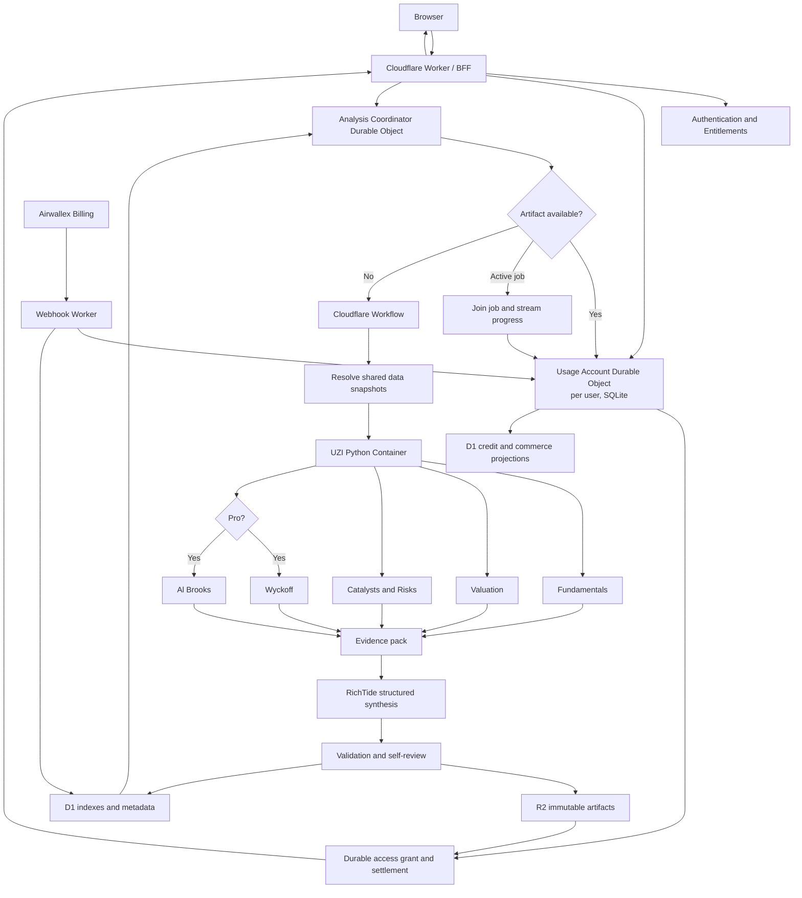
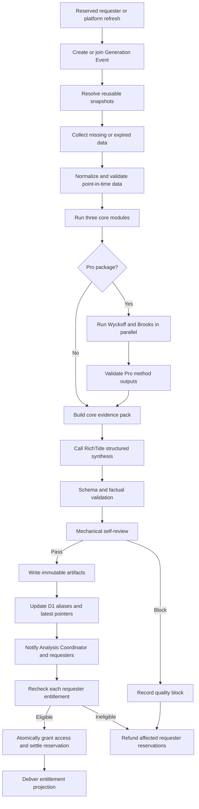

# UZI Cloudflare Retail Investor Intelligence Platform

## Simplified Product and Technical Design Specification v3.3

## 1. Executive decision

The product will no longer present dozens of analytical methods, twenty-two dimensions, a large investor-persona jury, or four confusing subscription tiers as separate customer-facing offerings.

The product will answer five practical questions:

1. **Is this a good business?**
2. **What is a reasonable valuation range?**
3. **What could materially improve or damage the thesis?**
4. **What market-structure phase is the stock in?**
5. **What is current price action implying about continuation, reversal, and price targets?**

These questions map to five analysis modules:

| Module | Primary question | Availability |
|---|---|---|
| **Fundamentals & Business Quality** | Is this a good business? | Lite and Pro |
| **Valuation & Scenarios** | What is it reasonably worth? | Lite and Pro |
| **Catalysts & Risks** | What could change the thesis? | Lite and Pro |
| **Wyckoff Market Structure** | Is the market accumulating, marking up, distributing, or marking down? | **Pro only** |
| **Al Brooks Price Action** | Is the current setup more likely to continue, fail, pull back, or reverse, and where are the target zones? | **Pro only** |

A sixth component, **Unified Decision Map**, reconciles the five modules. It is a synthesis layer, not another analysis method.

The subscription structure will also be simplified to:

```text
FREE → LITE → PRO
```

All LLM-backed interpretation and synthesis uses one fixed server-side model profile: **OpenAI GPT-5.6 Sol** with **medium** reasoning effort, called only through the company gateway at `https://api.rich-tide.com/v1`. There is no alternate model, direct OpenAI endpoint, direct third-party provider path, automatic model or effort substitution, client-selected model, or BYOK path. If that exact route is unavailable or rejects the request, the LLM-dependent step fails closed and follows the normal retry, degradation, or refund path.

The initial frontend is **Simplified Chinese only**, using the canonical locale `zh-CN`. Every RichTide-owned frontend for public visitors, customers, support staff, administrators, and operators—including each page, control, status, validation message, error, chart label, billing disclosure, accessibility label, and export—must render in Simplified Chinese. Internal identifiers may remain stable English codes, but they must never appear as untranslated user-interface copy.

The previous `PRO_LITE` tier is removed.

Lite and Pro include a monthly allowance of customer-facing **Analysis Credits**. Active paid subscribers may purchase additional prepaid usage packs without changing plan, but purchased credits extend quantity only: they never unlock a higher-tier capability. Every user's first unlock of an equivalent analysis costs the same published package rate, whether that user initiated generation, joined an active job, or received a cached artifact. This separates fair customer usage from the platform's internal LLM and infrastructure cost.

### 1.1 Source basis

This specification is grounded in:

- the existing UZI-Skill architecture and analytical codebase;
- the supplied `Wyckoff.md` research report;
- the supplied `Al Brooks .md` research report;
- the prior v2 Cloudflare platform specification;
- the official Cloudflare Durable Objects, SQLite storage, and D1 documentation linked in Section 13.2;
- the official Airwallex Billing, checkout, webhook, refund, and dispute documentation linked in Section 20.8, verified for this revision on 2026-08-20.

The source reports are treated as methodology inputs, not as proof of predictive performance. In particular:

- Wyckoff is implemented as contextual market structure and price/volume evidence, with engineering thresholds explicitly separated from classic principles;
- Al Brooks is implemented as a conditional-probability price-action framework, with production probabilities estimated and calibrated independently rather than copied from informal 60%, 70%, or 80% guidelines;
- neither method is allowed to bypass evidence, quality controls, entitlement checks, or the product's non-advisory boundary.

---

## 2. Why these five modules belong together

The retained modules are complementary rather than redundant.

### 2.1 Fundamentals & Business Quality

This module determines the economic quality of the company: growth, margins, returns on capital, cash generation, balance-sheet strength, dilution, governance, segment economics, and competitive position.

It answers **what the investor owns**.

### 2.2 Valuation & Scenarios

This module translates business performance and expectations into a valuation range using a deliberately small toolkit:

- discounted cash flow;
- comparable-company valuation;
- reverse DCF or expectation-implied analysis;
- bull, base, and bear scenarios;
- sensitivity analysis.

It answers **what price may be reasonable under explicit assumptions**.

### 2.3 Catalysts & Risks

This module monitors earnings, filings, product events, regulation, policy, capital allocation, governance changes, controversies, litigation, financing, and other thesis-changing evidence.

It answers **what could make the current analysis wrong or obsolete**.

### 2.4 Wyckoff Market Structure

Wyckoff provides the medium-term structural lens. It evaluates price, volume, trading ranges, relative strength, effort versus result, and event sequences to estimate phase and supply-demand control.

It answers **where the stock may be in its accumulation–markup–distribution–markdown cycle**.

### 2.5 Al Brooks Price Action

Al Brooks provides the near-term execution-context lens. It classifies trend versus trading range, breakout strength, follow-through, pullback versus reversal, second entries, measured moves, structural magnets, and the relationship among probability, reward, and risk.

It answers **what the current bars are doing and which near-term paths deserve higher or lower probability**.

### 2.6 Shared context is not a separate product

The following data remain important, but will not appear as independent “methods”:

- market and sector regime;
- relative strength;
- volume and liquidity;
- capital flows where licensed and reliable;
- analyst-estimate changes;
- news and sentiment;
- support and resistance;
- governance and manipulation red flags;
- macro and policy context.

They are shared evidence used by the five modules.

---

## 3. What is removed from the customer-facing offer

The following capabilities may remain internally as calculations or evidence, but will not be marketed as separate analysis products.

### 3.1 Remove the 66-investor jury as a primary feature

The large investor-persona panel is visually interesting but creates several problems:

- it makes the product feel entertainment-oriented rather than professional;
- many personas overlap in the evidence they use;
- it is expensive to explain and maintain;
- simulated opinions may be misunderstood as real endorsements;
- it distracts from auditable evidence.

The deterministic rules may still be used internally as **perspective checks**, but the user will see only a small `其他解读` section when relevant.

### 3.2 Consolidate institutional methods

The following are absorbed into the three core modules:

| Previous method or dimension | New home |
|---|---|
| DCF | Valuation & Scenarios |
| Comparable companies | Valuation & Scenarios |
| Reverse DCF | Valuation & Scenarios |
| Three-statement projections | Internal input to valuation where needed |
| Unit economics | Fundamentals & Business Quality |
| Porter / moat analysis | Fundamentals & Business Quality |
| Earnings analysis | Catalysts & Risks |
| Catalyst calendar | Catalysts & Risks |
| Governance | Fundamentals and Catalysts & Risks |
| Sentiment | Supporting evidence in Catalysts & Risks and Brooks |
| Capital flow | Supporting evidence in Wyckoff and Catalysts & Risks |
| Trap/manipulation detector | Risk flags inside Catalysts & Risks |
| Macro and policy | Context inside Catalysts & Risks |
| Industry and peers | Fundamentals and Valuation |
| Technical indicators | Features inside Wyckoff and Brooks |

### 3.3 Remove or defer non-core products

The initial product will not expose separate modules for:

- LBO analysis;
- merger models;
- value-creation plans;
- AI-readiness scoring;
- morning notes;
- sector reports as a standalone product;
- portfolio rebalancing;
- automated trade execution;
- personalized position sizing;
- autonomous agents placing orders.

These may be reconsidered later only when customer evidence demonstrates a clear need.

---

## 4. Product positioning

### 4.1 Product statement

> A professional retail-investor research workspace that combines business quality, valuation, catalysts, Wyckoff market structure, and Al Brooks price action into one auditable decision map.

### 4.2 What the product is

The product is:

- an evidence-organizing research platform;
- a scenario and probability analysis tool;
- a way to monitor what changed;
- a structured technical-analysis system;
- an auditable alternative to unstructured chatbot stock opinions.

### 4.3 What the product is not

The product is not:

- a broker;
- an execution system;
- an autonomous trader;
- a promise of returns;
- a personalized financial adviser unless separately licensed and approved;
- a system that treats an author’s informal probability guideline as a production statistic.

### 4.4 Communication rule

All outputs must distinguish:

```text
Observed fact
Deterministic calculation
Statistical estimate
LLM interpretation
Engineering assumption
Unavailable or low-quality data
```

---

## 5. Subscription model

### 5.1 Plans

```text
FREE
LITE
PRO
```

#### 5.1.1 Free

Free is a useful market-information product, not a crippled demo.

Free users receive:

- instrument search;
- company profile;
- delayed or licensed quote snapshot according to data rights;
- key financial metrics;
- simplified valuation multiples;
- latest major event headlines;
- a cached one-paragraph research snapshot;
- a small watchlist;
- transparent locked previews of Pro modules without computed Pro outputs.

Free does not include fresh LLM generation on demand unless an eligible, campaign-scoped Promotional Credit grant is active. Free promotions may authorize limited Core analysis but never Pro modules.

#### 5.1.2 Lite

Lite is the core research subscription.

Lite users receive:

- Fundamentals & Business Quality;
- Valuation & Scenarios;
- Catalysts & Risks;
- `有何变化` updates;
- report history;
- watchlist monitoring;
- basic comparisons;
- standard exports;
- a monthly included Analysis Credit allowance;
- eligibility to purchase prepaid Analysis Credit packs;
- a unified core conclusion based on the three core modules.

Lite does not receive Wyckoff or Al Brooks calculations, derived labels, probabilities, event detections, target zones, method alerts, or Pro exports.

#### 5.1.3 Pro

Pro is the complete product.

Pro users receive everything in Lite plus:

- Wyckoff Market Structure;
- Al Brooks Price Action;
- multi-timeframe technical context;
- cross-method agreement and disagreement;
- Pro-only structure and price-action alerts;
- technical-analysis history;
- Pro comparisons;
- full exports and eligible API access;
- the ability to spend included or purchased Analysis Credits on either Core or Complete Pro analysis at published package rates;
- stricter provenance and model-quality views.

### 5.2 Feature matrix

| Capability | Free | Lite | Pro |
|---|---:|---:|---:|
| Company and quote snapshot | Yes | Yes | Yes |
| Key financial metrics | Basic | Full | Full |
| Fundamentals & Business Quality | Preview/cached summary | Yes | Yes |
| Valuation & Scenarios | Multiples only | Yes | Yes |
| Catalysts & Risks | Headlines | Yes | Yes |
| What changed | Limited | Yes | Yes |
| Wyckoff Market Structure | No | No | **Yes** |
| Al Brooks Price Action | No | No | **Yes** |
| Unified core synthesis | Limited | Yes | Yes |
| Unified five-module Decision Map | No | No | **Yes** |
| Watchlist alerts | Basic | Core alerts | Core + Pro method alerts |
| History | Limited | Core history | Full history |
| Comparisons | Basic | Core comparison | Full comparison |
| Export | No | Core report | Full report |
| API | No | Optional limited | Eligible |
| Fresh analysis usage | Promotional only | Included + purchased credits | Included + purchased credits |
| Purchase usage packs | No | **Yes** | **Yes** |

### 5.3 Entitlement keys

```text
instrument.view
quote.view
analysis.core.fundamentals
analysis.core.valuation
analysis.core.catalysts_risks
analysis.pro.wyckoff
analysis.pro.al_brooks
analysis.pro.decision_map
alerts.core
alerts.pro.wyckoff
alerts.pro.al_brooks
history.core
history.pro
export.core
export.pro
api.pro
billing.usage_pack.purchase
credits.balance.view
analysis.promo.core_lite
```

`analysis.promo.core_lite` is a time-bounded campaign entitlement paired with Promotional Credits; it is not part of the ordinary Free plan and cannot authorize Pro components. Credit quantity alone never creates this entitlement.

### 5.4 Strict Pro boundary

Wyckoff and Al Brooks outputs must be inaccessible to Free and Lite users through:

- page payloads;
- hidden HTML;
- GraphQL or REST fields;
- comparison endpoints;
- export files;
- signed URLs;
- search indexing;
- notification previews;
- browser caches;
- analytics events;
- downgrade history.

The server must produce an entitlement-specific projection rather than sending a full Pro artifact and hiding fields in the frontend.

### 5.5 Usage accounting

Customer usage and internal generation cost are separate concepts.

- **Generation Event**: the internal execution that creates a new immutable analysis artifact. Single-flight and caching ensure RichTide records and pays for at most one Generation Event for equivalent canonical inputs.
- **Analysis Access**: a user's first entitlement-authorized unlock of a published analysis artifact projection. Analysis Access, not raw LLM tokens or responsibility for initiating generation, is the customer-facing unit of usage.

An Analysis Access grant is durable evidence that usage was settled for that user and analysis family; it does not override current plan or campaign entitlement when the artifact is later retrieved.

Every user who first unlocks the same analysis spends the same package-specific Analysis Credit cost from an eligible balance, whether that user initiated the Generation Event, joined an active job, or received an equivalent cached artifact. The first requester never pays a premium or subsidizes later requesters.

#### 5.5.1 Package-weighted usage

Analysis Credits are pooled across eligible analysis packages, but each package has a stable published rate:

| Package | Analysis Credits per first unlock |
|---|---:|
| `SNAPSHOT_FREE` | 0 |
| `CORE_LITE` | 1 |
| `COMPLETE_PRO` | Configurable published Pro weight greater than 1 |

The Pro weight must be set from measured unit economics before commercial launch. It is a catalog value, not a pass-through of the actual tokens consumed by an individual request. A catalog version and package rate are captured when usage is reserved so an in-flight request cannot change price. Catalog changes apply prospectively and must be shown to customers before their next paid analysis.

#### 5.5.2 Delta pricing and partial publication

Analysis Access is cumulative within one canonical analysis family. A user pays only the difference between the highest projection already unlocked and the higher projection successfully delivered.

```text
No paid access -> CORE_LITE
cost = Core rate

No paid access -> COMPLETE_PRO
cost = Pro rate

Existing CORE_LITE access -> COMPLETE_PRO for the same analysis family
cost = Pro rate - Core rate

Existing COMPLETE_PRO access -> either projection in the same analysis family
cost = 0
```

If a `COMPLETE_PRO` request publishes only a valid Core projection, settle only the Core rate and release the reserved Pro-minus-Core difference. If Complete Pro later becomes available for the same analysis family, the user's upgrade costs only that released difference at the applicable disclosed catalog terms. If no eligible projection publishes, refund the full reservation.

Delta pricing applies only when the instrument, canonical input snapshot, component lineage, language, and analysis-family identity match. Access to a stale, superseded, differently parameterized, or independently generated family does not create an undisclosed discount.

Rules:

- reopening an artifact projection already unlocked by the same user: zero additional customer usage;
- a cache hit or active-job join not previously unlocked by that user: the same customer usage as any other first unlock of that package;
- a no-op refresh that returns an artifact already unlocked by that user: zero additional customer usage;
- infrastructure or quality-gate failure before publication: reserved customer usage is refunded;
- one package unlock is metered as one product action even when the artifact contains multiple internal components;
- generation initiators, active-job joiners, and cache recipients pay the same published package rate on first unlock;
- actual LLM tokens, data, compute, and storage costs are recorded against the Generation Event for unit-economics analysis, never exposed as the customer's billing unit;
- exact monthly allowances remain product configuration until actual model, data, and infrastructure costs are measured.

### 5.6 Purchased usage boundary

Purchased usage extends the quantity available to an active paid subscriber; it never grants a feature entitlement or substitutes for a higher plan.

- only active Lite and Pro subscribers may purchase usage packs;
- Lite subscribers may spend included or purchased usage only on `CORE_LITE`;
- Pro subscribers may spend included or purchased usage on `CORE_LITE` and `COMPLETE_PRO` at their published package rates;
- Free users cannot purchase usage packs or use a purchased balance to unlock fresh paid analysis;
- purchased usage cannot unlock Wyckoff, Al Brooks, the five-module Decision Map, or any other Pro entitlement for a Lite or Free user;
- after a downgrade, the remaining purchased balance stays associated with the account, but spending is limited by the account's current plan entitlements;
- clients cannot select a more privileged package by presenting a purchased balance; the server resolves both entitlement and package before reserving usage.

### 5.7 Balance lifecycle and spend order

Included, Purchased, and Promotional Credits are distinct balance sources with independent grant and expiration records.

#### Included plan usage

- monthly subscriptions receive a new included allowance at each billing-period renewal;
- annual subscriptions receive the annual plan's allowance in monthly grants rather than as one up-front annual balance;
- unused included usage expires at the end of its monthly grant period and does not roll over;
- an upgrade or downgrade applies the commercial proration policy without rewriting historical grants or ledger entries.

#### Purchased usage

- every completed purchase creates an immutable purchase lot with its own original quantity, remaining quantity, purchase reference, granted timestamp, and expiration timestamp;
- purchased usage expires 12 months after purchase where permitted by applicable law;
- a jurisdiction-specific policy may extend or remove expiration when required, but may not shorten the disclosed validity period;
- subscription renewal, upgrade, or downgrade does not erase purchased usage;
- plan entitlement still controls which package the user may unlock when spending a retained balance.

#### Spend order and disclosure

- reservations draw from the eligible balance expiring soonest, regardless of whether it is an included grant or purchase lot;
- settlement consumes the exact lots captured by the reservation; refunds restore usage to those same lots and preserve their original expiration dates;
- the customer balance view shows Included, Purchased, and Promotional Credits separately, with the next expiration date and amount;
- reminders are sent before purchased usage expires, using configurable notification windows such as 30 days and 7 days;
- a scheduled reconciliation process detects expired, overspent, missing, or provider-mismatched grants without mutating immutable ledger history.

### 5.8 Prepaid usage-pack purchase model

The initial release supports customer-initiated prepaid usage packs only.

- the commercial catalog exposes a small fixed set of pack sizes rather than arbitrary quantities;
- each pack is a one-time purchase and grants usage only after verified payment confirmation;
- before checkout, the user sees the usage quantity, approximate `CORE_LITE` and `COMPLETE_PRO` first-unlock equivalents, validity period, subtotal, taxes where applicable, and final amount;
- the server resolves an approved pack identifier and price; the client cannot submit an arbitrary amount, currency, quantity, or usage grant;
- an analysis reservation is rejected when eligible Included, Purchased, and Promotional Credits cannot cover the disclosed incremental cost;
- balances never become negative, and RichTide never converts excess use into a surprise invoice or postpaid charge;
- automatic recharge is out of scope for the initial release;
- any future automatic recharge requires a separate opt-in design with customer-controlled amount, threshold, monthly monetary cap, notifications, cancellation, payment-failure handling, and regional review.

### 5.9 Pricing and contribution-margin guardrails

Plan allowances, package weights, and usage-pack prices must be derived from measured unit economics rather than guessed token budgets.

For each package, calculate a rolling P90 fully loaded cost per published artifact:

```text
p90_fully_loaded_package_cost
= P90(
    LLM input and output cost
  + licensed data allocation
  + Container and Workflow compute
  + Durable Object, D1, R2, Queue, and delivery cost
  + payment-fee allocation
  + refund and chargeback allocation
  + support allocation
)
```

Commercial rules:

- set the published `COMPLETE_PRO` usage weight from the conservative Lite-to-Pro P90 cost ratio, rounded up to a simple customer-facing value;
- size each plan's included monthly allowance so full utilization still satisfies the approved minimum contribution-margin floor;
- price purchased usage above the effective per-unit economics of the subscription allowance so recurring subscription remains the best value;
- pack-volume discounts must be modest, must not cross the minimum contribution-margin floor, and must not make repeated top-ups a rational substitute for the intended plan;
- do not launch or continue selling a catalog entry when its current cost evidence cannot demonstrate the margin floor under full utilization;
- model-provider savings and cache or single-flight efficiencies accrue to platform margin and resilience; they do not change the published rate for an individual Analysis Access;
- exact plan prices, included allowances, package weights, pack sizes, pack prices, currencies, tax treatment, and minimum margin thresholds live in a versioned commercial catalog rather than application code;
- every subscription, purchase, and usage reservation captures the applicable catalog version for audit and reconciliation;
- catalog changes are prospective and require customer disclosure; they never rewrite completed purchases, settled usage, or historical ledgers.

### 5.10 Refunds, disputes, and chargebacks

Usage restoration and cash reimbursement are separate operations. An analysis failure restores reserved usage; it does not automatically refund the payment that originally funded a purchase lot.

- a wholly unused purchase lot—its full quantity remains and none is actively reserved or settled—may be voluntarily refunded only within the disclosed cooling-off window or any longer period required by applicable law;
- once any usage from a purchase lot has settled, that lot is no longer voluntarily refundable unless consumer law or an approved exceptional-remediation policy requires otherwise;
- before requesting a provider refund, RichTide atomically locks the purchase lot so it cannot be reserved or spent concurrently;
- verified refund completion revokes the unused units and records the provider refund identifier, amount, currency, reason, actor, and timestamps without deleting the original purchase or grant entries;
- a failed refund unlocks the lot only after provider reconciliation confirms that no money moved;
- a payment dispute freezes the affected purchase lot and blocks further spending from it while preserving unrelated balances and entitlements unless broader fraud controls are triggered;
- a lost chargeback revokes all remaining units from the affected lot;
- usage already consumed from a charged-back lot becomes a financial-risk and abuse record, never a negative usage balance or an undisclosed customer debt;
- provider notifications for refunds, disputes, and chargebacks are signature-verified, idempotent, tolerant of reordering, and reconciled against provider state;
- jurisdiction-specific consumer rights override the default commercial policy and must be represented as explicit policy configuration rather than ad hoc support edits.

### 5.11 Per-user reservation and shared-generation settlement

Customer usage is always reserved and settled per user, even when several users share one Generation Event.

```text
User request
-> resolve entitlement and published package rate
-> return existing Analysis Access when already unlocked
-> otherwise create or reuse an idempotent per-user reservation
-> find, join, or initiate the shared Generation Event
-> publish the immutable artifact
-> create a durable per-user Analysis Access grant
-> settle that user's reservation against its captured balance lots
-> deliver the entitlement-specific artifact projection
```

Rules:

- a new Generation Event, an active-job join, and a first cached unlock all require the same applicable first-unlock or delta reservation for users with the same prior access state;
- equivalent requests share the Generation Event but never share, transfer, or aggregate customer reservations;
- retries and duplicate requests from the same user reuse the same idempotent reservation or existing Analysis Access grant;
- reservation creation, balance-lot allocation, access-grant creation, and settlement transitions are uniquely constrained and safe under concurrent requests;
- successful publication commits the user's access grant, settlement allocations, ledger entries, and projection outbox together in one Usage Account transaction; logical validation creates the access transition before closing the reservation;
- generation failure, quality blocking, cancellation before publication, or entitlement loss before delivery refunds that user's reservation to the original balance lots;
- one user's insufficient balance, entitlement loss, cancellation, or refund does not affect another user's reservation or the shared Generation Event;
- no artifact payload, signed URL, export, or Pro component is delivered before the server has durably resolved that user's access-grant and settlement state;
- generation-cost telemetry remains attached to the one Generation Event, while customer usage telemetry remains attached to each Analysis Access.

#### 5.11.1 Required state machines

```text
Reservation
OPEN -> CLOSED_SETTLED | CLOSED_PARTIAL | CLOSED_RELEASED

Analysis Access within one family
NONE -> CORE_GRANTED -> PRO_GRANTED

Credit grant
ACTIVE -> EXHAUSTED | EXPIRED | FROZEN | REVOKED
FROZEN -> ACTIVE | EXPIRED | REVOKED

Usage-pack purchase
PENDING_CHECKOUT -> PAYMENT_VERIFYING | CANCELLED | EXPIRED
PAYMENT_VERIFYING -> PAID_GRANTED | PAYMENT_FAILED
PAID_GRANTED -> REFUND_PENDING | DISPUTED
REFUND_PENDING -> REFUNDED | PAID_GRANTED
DISPUTED -> PAID_GRANTED | CHARGEBACK_LOST
```

Transitions are append-only, idempotent, timestamped, and validated against allowed prior states. `CLOSED_PARTIAL` records both the settled projection rate and the released difference. Provider reconciliation may request an existing transition again but may not bypass the state machine.

A checkout marked `CANCELLED`, `EXPIRED`, or `PAYMENT_FAILED` may return to `PAYMENT_VERIFYING` only when an authoritative provider re-fetch proves that payment nevertheless progressed; record this as an explicit reconciliation transition rather than overwriting the earlier state.

### 5.12 Subscription cancellation and retained purchased usage

Cancellation schedules the end of paid access; it does not immediately revoke a period the customer has already paid for or erase purchased usage.

- paid entitlements and the current included-usage grant remain active until the provider-confirmed paid-through timestamp;
- an annual subscription scheduled not to renew continues receiving its monthly Included Credit grants through the paid-through timestamp unless the provider confirms an earlier refund, revocation, dispute restriction, or effective termination;
- unused included usage expires when that paid period ends and does not convert into purchased usage, cash value, or rollover credit;
- purchased usage remains associated with the account and retains its original expiration date;
- when the subscription becomes Free, purchased usage is frozen and cannot fund fresh paid analysis;
- resubscribing the same account to Lite or Pro makes the unexpired purchased balance spendable again, subject to the new plan's entitlements;
- cancellation alone does not create a subscription refund or a usage-pack refund; the applicable refund policy remains authoritative;
- the cancellation confirmation shows the effective paid-through timestamp, the included usage that will expire, the purchased usage that will be frozen, each relevant expiration date, and the consequences of later resubscription;
- provider cancellation, renewal, and entitlement webhooks are reconciled before balance state is presented as final.

### 5.13 Customer terminology and usage disclosure

**Analysis Credit** is the customer-facing usage unit. Customers never buy or spend raw LLM tokens and are never charged differently because an artifact came from a new Generation Event, an active-job join, or a cache.

```text
1 CORE_LITE first unlock = 1 Analysis Credit
1 COMPLETE_PRO first unlock = the published Pro credit rate
Reopen an already-unlocked artifact = 0 Analysis Credits
```

Analysis Credits are non-transferable rights to eligible platform usage. They are not currency, stored cash, an investment asset, or independently redeemable value. Cash reimbursement is available only through the applicable refund and consumer-rights policy.

Customer disclosure requirements:

- before analysis confirmation, show the package, Analysis Credit cost, balance sources that may be used, and projected remaining balance;
- label package-equivalent counts as estimates when a balance can be spent across packages with different rates;
- after settlement or refund, show the Analysis Credit amount, analysis or artifact reference, balance source, status, and timestamp;
- the balance page separates Included, Purchased, and Promotional Credits, shows upcoming expirations, and provides an immutable activity history;
- the purchase page shows the usage-pack terms before redirecting to hosted checkout;
- insufficient-balance responses show the required credits, current eligible credits, and permitted actions such as buying a pack or changing plan;
- do not expose raw token counts, model prices, cache state, single-flight state, internal margin, or another customer's activity as customer billing concepts.

### 5.14 Promotional Credits

Promotional Credits are non-purchased, campaign-scoped grants and are never represented as purchased customer value.

- every campaign defines an immutable campaign identifier, eligible audience, package scope, quantity, grant window, expiration, locale or jurisdiction restrictions, and abuse limits;
- a Free-user promotion may authorize a limited `CORE_LITE` first unlock even though ordinary Free entitlement does not include fresh generation;
- Promotional Credits never authorize `COMPLETE_PRO`, Wyckoff, Al Brooks, the five-module Decision Map, Pro exports, or another Pro entitlement;
- Promotional Credits are non-transferable, non-refundable, non-redeemable, and have no cash value;
- eligible Promotional Credits participate in the same earliest-expiration reservation order but remain visibly separate from included and purchased balances;
- campaign grants are idempotent per campaign and account and cannot be duplicated by retries, identity relinking, or webhook replay;
- verified-account, velocity, device-risk, payment-risk, and campaign-specific controls must prevent promotional farming without exposing sensitive risk signals;
- campaign expiration or revocation never mutates historical grants, reservations, settlements, access grants, or audit events.

### 5.15 Versioned commercial catalog contract

The commercial catalog is immutable after approval. Changes create a new version with a prospective activation timestamp; they never edit the catalog captured by a subscription, purchase, reservation, settlement, or refund.

```yaml
catalog_version: <immutable-id>
status: DRAFT | APPROVED | ACTIVE | RETIRED
effective_at: <timestamp>
market: <commercial-market>
currency: <iso-4217>
minimum_contribution_margin: <approved-ratio>

package_rates:
  SNAPSHOT_FREE: 0
  CORE_LITE: 1
  COMPLETE_PRO: <simple-integer-greater-than-1>

plans:
  LITE:
    monthly_provider_price_id: <server-only-reference>
    annual_provider_price_id: <server-only-reference>
    included_credits_per_month: <measured-catalog-value>
  PRO:
    monthly_provider_price_id: <server-only-reference>
    annual_provider_price_id: <server-only-reference>
    included_credits_per_month: <measured-catalog-value>

usage_packs:
  - pack_id: <immutable-internal-sku>
    credits: <fixed-quantity>
    amount: <major-currency-unit>
    provider_price_id: <server-only-reference>
    expires_after: P12M
```

The customer API returns only public catalog fields and customer-facing terms. Provider identifiers, internal cost evidence, risk controls, and margin thresholds remain server-side. Catalog activation requires economic, payment-provider, tax, legal, product, and operational approval evidence.

---

## 6. Core Module 1 — Fundamentals & Business Quality

### 6.1 Purpose

Determine whether the company has durable economic quality and whether reported performance is supported by cash generation and balance-sheet capacity.

### 6.2 Required evidence

- business description and segments;
- revenue and segment growth;
- gross, operating, and net margins;
- ROE and ROIC where meaningful;
- operating cash flow and free cash flow;
- cash-conversion quality;
- leverage, liquidity, and refinancing exposure;
- share count, dilution, and buybacks;
- customer, product, or geographic concentration where available;
- governance and capital allocation;
- peer and industry benchmarks;
- accounting or disclosure anomalies.

### 6.3 Output

```json
{
  "module": "FUNDAMENTALS_QUALITY",
  "as_of": "...",
  "quality_score": 0,
  "confidence": 0.0,
  "business_summary": "...",
  "strengths": [],
  "weaknesses": [],
  "financial_trends": [],
  "cash_quality": {},
  "balance_sheet": {},
  "capital_allocation": {},
  "peer_context": {},
  "data_gaps": [],
  "evidence_ids": []
}
```

### 6.4 User-facing presentation

The module should show five cards:

1. Growth
2. Profitability
3. Cash generation
4. Balance sheet
5. Business durability and governance

Each card must expose the facts and formulas behind the conclusion.

### 6.5 Quality gates

- no score when critical statements are stale or missing;
- no mixing of annual and trailing-period values without labels;
- no treating bank or insurer balance sheets with industrial-company ratios;
- no peer comparison across incompatible accounting or currency bases without normalization;
- every LLM statement containing a number must map to a structured input.

---

## 7. Core Module 2 — Valuation & Scenarios

### 7.1 Purpose

Estimate a range of plausible values and show which expectations are already embedded in the market price.

### 7.2 Retained valuation methods

Only three user-facing methods are retained:

1. **DCF or an industry-appropriate intrinsic-value model**
2. **Comparable-company valuation**
3. **Reverse DCF / expectations analysis**

Bull, base, and bear scenarios are not separate methods; they are scenario variants.

### 7.3 Model selection

The system must select a suitable valuation family:

| Company type | Preferred model |
|---|---|
| Mature non-financial | FCFF or owner-earnings DCF + comps |
| High-growth company | Revenue/margin scenario DCF + EV/revenue or EV/GP comps |
| Bank | Residual income / P/B and ROE framework |
| Insurer | Embedded-value or P/B/ROE framework where data permit |
| REIT | FFO/AFFO and NAV framework |
| Commodity producer | Normalized-cycle cash flow and asset/peer valuation |
| Pre-revenue biotech | Scenario-weighted pipeline value; clearly labeled high uncertainty |

### 7.4 Output

```json
{
  "module": "VALUATION_SCENARIOS",
  "currency": "USD",
  "market_price": 0,
  "valuation_range": {
    "bear": 0,
    "base": 0,
    "bull": 0
  },
  "method_results": {
    "intrinsic": {},
    "comps": {},
    "reverse_dcf": {}
  },
  "key_assumptions": [],
  "sensitivity": [],
  "expectations_implied": [],
  "confidence": 0.0,
  "data_gaps": [],
  "evidence_ids": []
}
```

### 7.5 Presentation rules

The product must not show one falsely precise “fair value.” It must show:

- a range;
- the major assumptions;
- sensitivity to growth, margins, discount rate, and terminal assumptions;
- the relationship between current price and each scenario;
- where methods disagree;
- what new evidence would change the range.

### 7.6 Quality gates

- explicit units and currencies;
- deterministic formulas outside the LLM;
- zero tolerance for invented financial values;
- no DCF when business economics or data make it meaningless without a warning;
- terminal value concentration disclosed;
- reverse-DCF assumptions reconciled with historical and peer context.

---

## 8. Core Module 3 — Catalysts & Risks

### 8.1 Purpose

Monitor evidence that can change the investment thesis or invalidate the current analysis.

### 8.2 Scope

#### Catalysts

- earnings and guidance;
- product launches or approvals;
- customer wins or losses;
- capacity expansion;
- capital allocation;
- restructuring;
- regulation and policy;
- industry pricing changes;
- litigation resolution;
- financing or refinancing;
- index inclusion or other material market-structure events where relevant.

#### Risks

- earnings-quality deterioration;
- leverage and refinancing;
- dilution;
- governance changes;
- related-party transactions;
- customer or supplier concentration;
- regulatory exposure;
- litigation;
- accounting restatement;
- insider selling or unusual capital actions;
- manipulation, promotional, or low-liquidity warning signs;
- thesis dependence on one uncertain event.

### 8.3 Output

```json
{
  "module": "CATALYSTS_RISKS",
  "as_of": "...",
  "upcoming": [],
  "recent_material_events": [],
  "risk_register": [],
  "thesis_changes": [],
  "red_flags": [],
  "next_review_triggers": [],
  "confidence": 0.0,
  "data_gaps": [],
  "evidence_ids": []
}
```

### 8.4 What changed

This module owns the product’s most important recurring feature: **What changed since the previous analysis?**

Possible changes include:

- financial estimates changed;
- valuation assumptions changed;
- new filing or material event;
- risk severity changed;
- management guidance changed;
- a thesis-supporting condition was met;
- a thesis-invalidation condition was triggered;
- Pro technical structure changed.

### 8.5 Quality gates

- official filings take precedence over secondary reports;
- event time and observable time must be distinct;
- rumors and social posts must be labeled as unverified;
- no future event is described as certain;
- materiality must be explained;
- stale events must not be repeated as new.

---

## 9. Pro Module 1 — Wyckoff Market Structure

### 9.1 Product role

Wyckoff is the medium-term structural module. It should be engineered as a **market-structure state machine plus price/volume evidence system**, not as a list of isolated indicators.

### 9.2 Core questions

1. Is the stock trending or in a trading range?
2. Is the broader state markup, markdown, accumulation, reaccumulation, distribution, redistribution, or unknown?
3. What are the probabilities of the relevant A–E phases?
4. Which events are candidates and which are confirmed?
5. Which side appears to control supply and demand?
6. What structural levels would weaken or invalidate the interpretation?
7. What conservative target zones are supported by structure or Point-and-Figure cause?

### 9.3 Required concepts

- supply and demand;
- cause and effect;
- effort versus result;
- relative strength;
- trading-range boundaries;
- accumulation and distribution phases;
- reaccumulation and redistribution;
- candidate and confirmed events;
- Spring, Test, SOS, LPS, UT/UTAD, SOW, LPSY;
- trend or stride breaks;
- phase uncertainty;
- conservative P&F target ranges.

### 9.4 Important methodology rule

Classic Wyckoff descriptions mainly use relative relationships such as expanding or contracting spread and volume. Universal ATR, RVOL, percentile, or bar-count thresholds are not canonical.

Therefore each threshold must be stored as:

```json
{
  "value": 1.3,
  "unit": "RVOL",
  "origin": "ENGINEERING_INITIAL_VALUE",
  "parameter_set_version": "wyckoff-v1"
}
```

The product must never present an engineering threshold as an original Wyckoff rule.

### 9.5 Timeframes

Recommended initial presets:

| Preset | Context | Primary | Confirmation |
|---|---|---|---|
| Position | Monthly | Weekly | Daily |
| Swing | Weekly | Daily | 60-minute where licensed |
| Active swing | Daily | 60-minute | 15- or 30-minute where licensed |

The initial commercial release should prioritize Daily and Weekly data because they are more stable, cheaper, and easier to license and validate.

### 9.6 State output

```json
{
  "module": "WYCKOFF_STRUCTURE",
  "status": "RESEARCH_BETA",
  "timeframes": ["1W", "1D"],
  "structure": {
    "regime": "TRADING_RANGE",
    "range_support": 0,
    "range_resistance": 0,
    "phase_probabilities": {
      "ACCUM_C": 0.0,
      "ACCUM_D": 0.0,
      "DISTRIB_C": 0.0,
      "UNKNOWN": 0.0
    },
    "phase_entropy": 0.0
  },
  "events": [],
  "supply_demand": {},
  "effort_result": {},
  "relative_strength": {},
  "target_zones": [],
  "invalidation_levels": [],
  "confidence": 0.0,
  "data_gaps": [],
  "evidence_ids": []
}
```

### 9.7 User interface

The Wyckoff view should contain:

1. Market-cycle state
2. Phase probability distribution
3. Annotated event sequence
4. Supply/demand and effort/result evidence
5. Trading-range boundaries
6. Structural invalidation levels
7. Target zones with sensitivity
8. Data quality and parameter-version disclosure

The chart must distinguish:

- candidate event;
- confirmed event;
- invalidated event;
- historical event identified only after confirmation.

### 9.8 Alerts

Pro alerts may include:

```text
New Spring candidate
Spring Test confirmed
SOS confirmed
LPS candidate
UT/UTAD candidate
SOW confirmed
LPSY candidate
Phase probability changed materially
Trading-range boundary changed
Structure invalidated
```

Alerts must fire only from closed-bar or explicitly labeled intrabar-preview logic.

### 9.9 Quality and research gates

Before general availability:

- event definitions frozen and versioned;
- point-in-time replay implemented;
- no pivot look-ahead;
- per-event precision and recall reported;
- phase macro-F1 and calibration reported;
- parameter sensitivity reported;
- false Spring and false UTAD hard negatives included;
- target performance evaluated separately from trading profitability;
- no claim of proven predictive power without independent validation.

---

## 10. Pro Module 2 — Al Brooks Price Action

### 10.1 Product role

Al Brooks is the near-term price-action module. It should be implemented as a **conditional-probability language** rather than a rigid pattern library.

The analytical order is:

```text
Market state
→ Direction
→ Location and context
→ Breakout quality
→ Follow-through
→ Pullback or reversal test
→ Target cluster
→ Probability × reward versus loss probability × risk
```

### 10.2 Core questions

1. Is the market in a trend, trading range, or breakout state?
2. What is the current Always-In directional proxy, if any?
3. Is a breakout strong, weak, or unconfirmed?
4. Did follow-through confirm or weaken the breakout?
5. Is an opposite move more consistent with a pullback or a major reversal?
6. Is a second-entry structure present?
7. Which targets are relevant?
8. What is the calibrated probability of reaching an upside barrier before a downside barrier over a defined horizon?
9. Does the setup have positive expected value after explicit reward, risk, and cost assumptions?

### 10.3 Important methodology rule

The product must not hardcode informal 60%, 70%, or 80% guidelines as production probabilities.

All production probabilities must be estimated from point-in-time data and calibrated by:

- market;
- timeframe;
- regime;
- exact pattern definition;
- target and stop definition;
- forecast horizon;
- transaction-cost assumptions.

### 10.4 Required concepts

- trend bar and trading-range bar;
- trend versus trading range;
- breakout mode;
- Always-In proxy;
- strong breakout;
- follow-through;
- failed breakout;
- pullback;
- High 1 / High 2 and Low 1 / Low 2 proxies;
- second entry;
- tight channel and microchannel;
- first reversal versus major trend reversal;
- range-height measured move;
- breakout-height measured move;
- Leg 1 = Leg 2;
- structural magnets;
- Trader’s Equation.

### 10.5 Timeframes

Initial presets:

| Preset | Context | Primary signal | Typical horizon |
|---|---|---|---|
| Position | Monthly/Weekly | Weekly | 13–52 weeks |
| Swing | Weekly | Daily | 5–20 days |
| Active swing | Daily | 60-minute | 8–24 bars |

Intraday 5–15 minute analysis should remain deferred until exchange-grade or contractually permitted intraday data and a separate validation set are available.

### 10.6 Output

```json
{
  "module": "AL_BROOKS_PRICE_ACTION",
  "status": "RESEARCH_BETA",
  "regime_probabilities": {
    "TREND": 0.0,
    "TRADING_RANGE": 0.0,
    "BREAKOUT": 0.0
  },
  "direction": {
    "always_in_proxy": "NEUTRAL",
    "confidence": 0.0
  },
  "events": [],
  "continuation_reversal": {
    "continuation_probability": 0.0,
    "reversal_probability": 0.0,
    "horizon_bars": 0,
    "calibration_version": "..."
  },
  "targets": [],
  "barrier_forecasts": [],
  "traders_equation": {
    "probability": 0.0,
    "reward_r": 0.0,
    "risk_r": 0.0,
    "estimated_cost_r": 0.0,
    "expected_value_r": 0.0
  },
  "invalidation_levels": [],
  "data_gaps": [],
  "evidence_ids": []
}
```

### 10.7 Target cluster

The module may report:

- previous swing high or low;
- trading-range midpoint;
- opposite edge of the range;
- breakout point retest;
- range-height measured move;
- breakout-height measured move;
- Leg 1 = Leg 2;
- 1R and 2R execution envelopes;
- higher-timeframe support or resistance.

Each target must include:

```json
{
  "target": 0,
  "basis": "RANGE_HEIGHT_MM",
  "horizon_bars": 10,
  "target_before_stop_probability": 0.0,
  "confidence_interval": [0.0, 0.0],
  "calibration_sample_size": 0,
  "status": "RESEARCH_BETA"
}
```

### 10.8 User interface

The Brooks view should contain:

1. Trend/range/breakout regime
2. Always-In proxy
3. Breakout and follow-through evidence
4. Pullback versus reversal assessment
5. Second-entry and structural evidence
6. Target cluster
7. Barrier probabilities
8. Trader’s Equation table
9. Invalidation conditions
10. Calibration and sample-size disclosure

### 10.9 Alerts

Pro alerts may include:

```text
Strong breakout candidate
Follow-through confirmed
Breakout failed
Always-In proxy changed
Second-entry candidate
Major trend reversal conditions developing
Target probability changed materially
Trader’s Equation changed from negative to positive or vice versa
```

### 10.10 Quality and research gates

- no look-ahead from follow-through bars;
- exact entry, stop, target, and horizon definitions frozen before testing;
- target-first and stop-first outcomes separated;
- censored outcomes retained rather than mislabeled;
- probability calibration reported;
- average R and costs reported separately from hit rate;
- block bootstrap and multiple-testing controls used;
- performance reported by market, timeframe, and regime;
- no claim that Brooks’s informal probability guidelines were statistically confirmed unless independently demonstrated.

---

## 11. Unified Decision Map

### 11.1 Purpose

The Decision Map is the product’s main output. It should reduce complexity rather than add another method.

It combines:

```text
Business quality
+ Valuation
+ Catalysts and risks
+ Wyckoff structure
+ Brooks price action
```

### 11.2 Core two-axis view

The main matrix uses:

- horizontal axis: **Fundamental attractiveness**;
- vertical axis: **Technical setup quality**.

Catalyst and risk severity modifies confidence and urgency.

```text
                         Technical setup quality
                    Weak                           Strong

Fundamentally   ┌──────────────────────┬────────────────────────┐
Attractive      │ Attractive, but wait │ Attractive + technically│
                │ for confirmation     │ constructive             │
                ├──────────────────────┼────────────────────────┤
Unattractive    │ No clear edge / avoid│ Tactical strength without│
                │ research priority    │ fundamental support       │
                └──────────────────────┴────────────────────────┘
```

### 11.3 Research-posture vocabulary

Approved statuses:

```text
ATTRACTIVE_BUT_EARLY
ATTRACTIVE_AND_CONSTRUCTIVE
FAIRLY_VALUED_WAIT_FOR_EVIDENCE
OVERVALUED_BUT_TECHNICALLY_STRONG
FUNDAMENTALLY_WEAK_TACTICAL_RALLY
EVENT_RISK_DOMINATES
STRUCTURE_DETERIORATING
NO_CLEAR_EDGE
INSUFFICIENT_DATA
```

These are research postures, not personalized trade instructions.

### 11.4 Agreement model

```json
{
  "fundamentals": "POSITIVE",
  "valuation": "POSITIVE",
  "catalysts_risks": "MIXED",
  "wyckoff": "CONSTRUCTIVE",
  "al_brooks": "NEUTRAL",
  "agreement": {
    "score": 0.68,
    "status": "PARTIAL_AGREEMENT",
    "main_disagreement": "中期结构偏积极，但近期突破尚缺乏延续性。"
  }
}
```

### 11.5 Synthesis rules

The LLM may explain the modules, but it must not override them silently.

The synthesis must:

- cite evidence IDs;
- identify method disagreement;
- distinguish long-term thesis from near-term setup;
- state what would change the conclusion;
- avoid converting uncertain probabilities into certainty;
- avoid personalized position sizing;
- avoid invented prices or events;
- state data gaps prominently.

### 11.6 Example output structure

```json
{
  "posture": "ATTRACTIVE_BUT_EARLY",
  "summary": "...",
  "long_term_view": "...",
  "near_term_view": "...",
  "main_supporting_evidence": [],
  "main_risks": [],
  "method_disagreements": [],
  "watch_conditions": [],
  "invalidation_conditions": [],
  "next_review_triggers": [],
  "evidence_ids": []
}
```

---

## 12. Information architecture and user experience

### 12.1 Simplified Chinese frontend contract

The initial release has one frontend locale: `zh-CN`. Set the document language to `lang="zh-CN"`; do not expose a language selector until another locale has a separately approved, complete translation and release gate.

The Simplified Chinese requirement applies to every RichTide-owned public, customer, support, administrator, and operator frontend surface:

- public landing, authentication, onboarding, account, research, watchlist, alert, billing, checkout-review, payment-return, refund, history, comparison, and export views;
- navigation, headings, buttons, links, form labels, placeholders, helpers, validation, empty states, loading and progress states, confirmations, dialogs, tooltips, toasts, errors, and recovery actions;
- chart titles, axes, legends, annotations, overlay labels, table headings, captions, evidence drawers, methodology explanations, freshness and quality states, and accessibility names or text alternatives;
- model-authored summaries, Decision Map narrative, report HTML/PDF, downloadable human-readable column headings, and customer-visible notifications generated by the frontend flow.

Use approved Simplified Chinese product terminology consistently. Stable machine values such as API paths, error codes, enum values, evidence IDs, methodology IDs, model provenance, ticker symbols, currency codes, and company or methodology proper names may remain unchanged internally. The UI maps them to Chinese display labels and never shows a raw identifier as fallback copy.

Source titles and short source excerpts may remain in their original language for audit fidelity. Whenever customer-visible source text is not Simplified Chinese, label its original language in Chinese and provide an adjacent, clearly marked Simplified Chinese summary; never silently present a machine translation as the original source text.

Use `Intl` formatting with `zh-CN` for dates, times, numbers, and percentages while preserving the instrument's explicit timezone, currency, unit, and market. Chinese typography must use a self-hosted Simplified-Chinese-capable webfont such as Noto Sans SC or Source Han Sans SC, with `PingFang SC`, `Microsoft YaHei`, and `sans-serif` as platform fallbacks. Preserve readable line height, avoid clipped glyphs and punctuation or single-character orphans where practical, and remain usable at supported mobile widths.

Missing or unknown translation keys fail CI. At runtime, server and gateway error codes map to reviewed Chinese messages; an unmapped failure uses a safe generic Chinese error with a traceable support identifier, never raw English, a stack trace, or provider/model text. Hosted third-party checkout must be configured and qualified for Simplified Chinese; if the required flow cannot remain Chinese, commercial activation is blocked rather than silently falling back to English.

One versioned `zh-CN` copy catalog is the sole authority for application-generated display strings across all frontend roles. Route components, chart renderers, export templates, billing adapters, and error presenters reference catalog keys rather than defining local English or Chinese literals. The catalog inventory must cover every reachable route, state, and notification; CI rejects missing, unused, duplicated, or non-Chinese display entries outside the approved identifier, proper-name, symbol, and original-source allowlist.

Each approved catalog has an immutable identifier such as `zh-CN@<content-hash>`, an activation timestamp, approval evidence, and a supersession pointer. Rendered reports and exports record `copy_catalog_version` and retain the exact catalog version used to create their user-visible text. Reopening or downloading an immutable rendition returns those original bytes; it must never silently re-render historical content with the current catalog. A copy-only correction creates a new immutable localized rendition linked to the same analytical artifact and original Analysis Access, costs zero Analysis Credits, and does not create a new Generation Event or analysis family. Current application chrome uses the active approved catalog and clearly labels a historical rendition when its embedded copy version differs.

Canonical customer terminology:

| Stable domain term or code | Simplified Chinese UI label |
|---|---|
| `FREE` / `LITE` / `PRO` | 免费版 / 轻享版 / 专业版 |
| `CORE_LITE` / `COMPLETE_PRO` | 核心分析 / 完整专业分析 |
| Research Posture | 研究判断 |
| Business Quality | 企业质量 |
| Valuation Range | 估值区间 |
| Catalysts / Risks | 催化剂 / 风险 |
| Market Structure | 市场结构 |
| Price Action | 价格行为 |
| What Changed | 有何变化 |
| Alternative interpretations | 其他解读 |
| Research Beta | 研究测试版 |
| Analysis Credit | 分析积分 |
| Included / Purchased / Promotional Credits | 套餐内积分 / 购买积分 / 活动积分 |
| Usage Pack | 积分包 |
| `PLAN_UPGRADE_REQUIRED` | 需要升级套餐 |
| `ANALYSIS_CREDITS_REQUIRED` | 分析积分不足 |
| `CATALOG_CHANGED` | 价格或套餐信息已更新 |
| `UNSUPPORTED_LANGUAGE` | 当前仅支持简体中文 |
| `PURCHASE_PENDING_VERIFICATION` | 购买记录待验证 |
| `PURCHASE_NOT_REFUNDABLE` | 该笔购买不符合退款条件 |
| `PAYMENT_ACCOUNT_RESTRICTED` | 付款账户受限 |

Terminology changes are versioned product-copy decisions. Do not create page-local synonyms for these concepts.

### 12.2 Instrument page

The instrument page should have only six top-level tabs:

```text
概览
基本面与企业质量
估值与情景
催化剂与风险
专业技术分析
来源与方法
```

Within `专业技术分析`:

```text
威科夫市场结构
阿尔·布鲁克斯价格行为
方法一致性
```

Non-Pro users see a clear explanation and sample methodology, but no computed fields.

### 12.3 Overview page

The overview should show:

- price and exact data timestamp;
- research posture;
- business-quality summary;
- valuation range;
- top catalyst;
- top risk;
- what changed;
- for Pro: Wyckoff phase and Brooks regime summary;
- data coverage and freshness;
- refresh status.

### 12.4 Progressive disclosure

The product should not lead with a long AI essay.

Each conclusion card should support an evidence drawer:

```text
结论
→ 关键事实
→ 公式或检测器输出
→ 来源与时间戳
→ 数据局限
→ 方法版本
```

### 12.5 Chart behavior

The main chart should support optional overlays:

- earnings and material events;
- valuation range bands;
- Wyckoff range boundaries and events;
- Brooks breakouts, failures, second entries, targets, and invalidation levels;
- higher-timeframe support and resistance.

Overlays must be visually separable and individually switchable.

### 12.6 What changed panel

The panel should prioritize meaningful changes:

```text
新增披露文件
业绩或指引发生变化
估值区间发生变化
风险严重程度发生变化
威科夫阶段概率发生变化
新的已确认威科夫事件
布鲁克斯市场状态发生变化
突破获得或失去延续性
目标概率发生重大变化
```

### 12.7 Analysis Credit and purchase experience

Usage must be understandable before the customer commits an Analysis Credit.

- the analysis action displays the package, published Analysis Credit cost, eligible balance, and projected post-analysis balance;
- the confirmation never distinguishes generation initiators, active-job joiners, and cache recipients because they pay the same first-unlock rate;
- reopening an already-unlocked artifact is labeled `已解锁` and requires no new confirmation or credits;
- an insufficient-balance state explains the shortfall and offers only actions permitted for the current plan: buy a usage pack, choose a lower-cost entitled package, or change plan;
- Lite users never see a usage-pack purchase as a way to unlock Pro capabilities;
- the balance surface separates Included, Purchased, and Promotional Credits and exposes amount, status, origin, next expiration, and recent activity;
- usage-pack checkout begins only after a review screen shows pack quantity, estimated Core and Pro equivalents, validity, currency, tax, total, refund rule, and the absence of automatic recharge;
- checkout return pages show `付款待验证` until a verified provider event and reconciliation grant the purchase lot;
- cancellation and downgrade surfaces disclose what expires, what freezes, and what remains available;
- expiration, low-balance, refund, dispute, and payment-failure notifications use clear non-alarmist language and link to the immutable activity record.

---

## 13. High-level Cloudflare architecture

The infrastructure remains Cloudflare-native, but the analysis graph is simplified.



### 13.1 Responsibilities

#### Workers

- web application backend;
- authentication/session checks;
- entitlement projection;
- request validation;
- rate limiting;
- report delivery;
- Analysis Credit preflight and checkout-order creation;
- Airwallex webhook verification and asynchronous event intake.

#### Durable Objects

**Analysis Coordinator**, one per canonical input signature:

- single-flight generation deduplication;
- progress subscribers and per-user requester registration;
- latest artifact pointer;
- job lease and recovery state;
- publication notification without owning customer balances.

**Usage Account**, one SQLite-backed object per user:

- authoritative Included, Purchased, and Promotional Credit grants;
- purchase lots, expirations, reservations, allocations, settlements, and refunds;
- durable Analysis Access grants;
- serialization of every balance-changing operation for that user;
- idempotent application of subscription, checkout, refund, dispute, and chargeback effects;
- alarms for grant expiration and reconciliation retry;
- D1 projection events for cross-account administration and analytics.

No external network call occurs inside a Usage Account storage transaction. Provider calls and long-running analysis execute outside the transaction, then return with an idempotency key for a short local state transition.

#### Workflows

- durable multi-step analysis;
- retries;
- idempotency;
- parallel execution of Pro methods;
- publication and per-requester settlement orchestration through Usage Account objects.

#### Containers

- Python and UZI-Skill execution;
- pandas and model calculations;
- market-data adapters;
- deterministic features and methods;
- optional HTML/PDF rendering.

#### R2

- immutable input snapshots;
- evidence packs;
- method outputs;
- validation results;
- reports and exports.

#### D1

- users;
- commercial catalogs and approved provider identifiers;
- subscription and entitlement projections;
- checkout, invoice, refund, dispute, and provider-event records;
- jobs;
- artifact index;
- aliases;
- cross-account credit and access projections, never authoritative balances;
- watchlists;
- alert state;
- billing reconciliation state.

#### RichTide gateway

- structured interpretation and synthesis only;
- no ownership of factual data or deterministic calculations;
- sole LLM profile: OpenAI GPT-5.6 Sol with medium reasoning effort;
- sole LLM base URL: `https://api.rich-tide.com/v1`;
- server-side credential custody only, with no direct provider, alternate model, alternate effort, client override, or BYOK path;
- fail closed when the exact gateway, model, and effort profile cannot be used.

### 13.2 Storage-authority references

The Usage Account design follows Cloudflare's current guidance to create one Durable Object per logical unit requiring strong coordination and to use SQLite-backed private transactional storage. D1 remains appropriate for global query and projection workloads but is not consulted as the mutable balance authority.

- [Cloudflare Rules of Durable Objects](https://developers.cloudflare.com/durable-objects/best-practices/rules-of-durable-objects/)
- [Cloudflare SQLite-backed Durable Object storage](https://developers.cloudflare.com/durable-objects/best-practices/access-durable-objects-storage/)
- [Cloudflare SQLite storage transactions](https://developers.cloudflare.com/durable-objects/api/sqlite-storage-api/)
- [Cloudflare D1 concurrency and limits](https://developers.cloudflare.com/d1/platform/limits/)

---

## 14. Analysis packages and artifact components

### 14.1 Package definitions

```text
SNAPSHOT_FREE
CORE_LITE
COMPLETE_PRO
```

#### SNAPSHOT_FREE

```text
instrument profile
quote overlay
key financial metrics
major-event headlines
cached summary projection
```

#### CORE_LITE

```text
fundamentals_quality
valuation_scenarios
catalysts_risks
core_synthesis
```

#### COMPLETE_PRO

```text
all CORE_LITE components
wyckoff_structure
al_brooks_price_action
decision_map
```

### 14.2 Component independence

Each component must have independent:

- schema version;
- engine version;
- methodology version;
- parameter version;
- source snapshot hash;
- quality status;
- artifact path;
- entitlement requirement.

A failed Pro component must not corrupt a valid core artifact.

### 14.3 Canonical artifact

The complete internal artifact may contain every component, but delivery must project it by entitlement.

```text
Canonical internal artifact
├── Free projection
├── Lite projection
└── Pro projection
```

---

## 15. Minute-level freshness, caching, and single-flight

### 15.1 Principle

Minute granularity is the timestamp resolution of the user-facing snapshot. It is not a requirement to rerun every module or LLM every minute.

### 15.2 Layered freshness

| Layer | Refresh rule | Typical LLM need |
|---|---|---|
| Quote overlay | Every minute during session | No |
| Technical bars | On relevant bar close or correction | No for deterministic methods |
| Fundamentals | New filing, correction, or scheduled refresh | Sometimes |
| Valuation | Material financial/estimate/price-assumption change | Sometimes |
| Catalysts & Risks | New material event or periodic scan | Often concise |
| Wyckoff | New relevant closed bar or structure invalidation | Only when narrative materially changes |
| Al Brooks | New relevant closed bar, follow-through confirmation, or regime change | Only when narrative materially changes |
| Decision Map | Material component change | Yes |

### 15.3 Keys

#### Exact minute result key

```text
result_key = SHA256(
  instrument_id
  + package
  + requested_utc_minute
  + input_snapshot_hash
  + component_versions
  + model_profile
  + prompt_version
  + language  # fixed to zh-CN for the initial release
)
```

#### Analysis family key

The family key identifies projections that share the same canonical evidence and are eligible for Core-to-Pro delta pricing:

```text
analysis_family_key = SHA256(
  instrument_id
  + input_snapshot_hash
  + component_versions
  + parameter_versions
  + model_profile
  + prompt_version
  + language  # fixed to zh-CN for the initial release
)
```

The package is intentionally excluded. Any input or lineage difference that could change the Core projection must change the family key.

#### Active job key

The active key excludes the minute:

```text
active_key = SHA256(
  instrument_id
  + package
  + input_snapshot_hash
  + component_versions
  + model_profile
  + prompt_version
  + language  # fixed to zh-CN for the initial release
)
```

This prevents duplicate jobs across consecutive minutes while one long-running analysis is still active.

### 15.4 Component keys

```text
core_key
wyckoff_key
brooks_key
decision_map_key
```

### 15.5 Request behavior

```text
1. Authenticate.
2. Resolve current plan, entitlements, commercial-catalog version, package, and published Analysis Credit rate.
3. Normalize instrument and resolve source and bar signatures.
4. Resolve the exact artifact, fresh equivalent artifact, or active Generation Event.
5. Return immediately when this user already has an Analysis Access grant for the resolved artifact projection.
6. Otherwise create or reuse an idempotent per-user reservation for the disclosed incremental cost in the Usage Account.
7. For an available artifact, create the access grant, settle the reservation, project by entitlement, and deliver.
8. For an active Generation Event, register this requester and stream progress without creating another generation.
9. Otherwise start one Workflow and register the reserved requester.
10. Publish only after quality gates pass; then grant and settle each still-eligible requester independently.
11. Refund each affected reservation when publication, quality, entitlement, or delivery authorization fails.
```

A platform-initiated background refresh may create a Generation Event without charging a user. Analysis Credits are settled only when a user first unlocks the resulting artifact. An automatic refresh may never silently consume customer credits.

### 15.6 Materiality triggers for LLM refresh

- new earnings or filing;
- valuation range changes materially;
- critical risk appears or clears;
- Wyckoff dominant phase changes;
- confirmed Spring, SOS, UTAD, SOW, LPS, or LPSY;
- Brooks regime or Always-In proxy changes;
- breakout gains or loses follow-through;
- target probability changes beyond configured delta;
- method disagreement changes materially;
- critical data-quality status changes.

A minor quote movement should normally update the overlay and deterministic calculations without rewriting the complete report.

---

## 16. Workflow

### 16.1 States

```text
CREATED
REQUESTERS_REGISTERED
SNAPSHOT_RESOLVING
DATA_COLLECTING
DATA_NORMALIZING
CORE_RUNNING
PRO_METHODS_RUNNING
EVIDENCE_PACKING
LLM_SYNTHESIS
VALIDATING
SELF_REVIEW
PUBLISHING
REQUESTER_ACCESS_GRANTING
REQUESTER_USAGE_SETTLING
COMPLETE
```

Failure states:

```text
RETRYABLE_FAILURE
PERMANENT_FAILURE
QUALITY_BLOCKED
ENTITLEMENT_REVOKED
CANCELLED
```

### 16.2 Execution



Requester settlement is fan-out work. Each user transition is idempotent and independent: one failed or revoked requester cannot roll back the published artifact, another user's access grant, or the shared Generation Event.

### 16.3 Partial publication

Recommended policy:

- a valid Core projection may publish when Pro methods fail;
- for a Complete Pro request that yields only Core, create only Core Analysis Access, settle only the Core rate or applicable Core delta, and release the reserved Pro difference;
- if Complete Pro later succeeds for the same analysis family, settle only the Core-to-Pro delta after a new disclosure and reservation;
- if the user already holds Complete Pro access for that family, both Pro and Core projections reopen for zero additional credits;
- Pro screen may show a method-specific unavailable status;
- Decision Map requiring both Pro methods is blocked if either required component fails;
- exports marked `完整专业分析` require all components to pass;
- no missing method may be silently replaced by an LLM guess;
- if no eligible projection passes, refund the full requester reservation.

---

## 17. RichTide LLM integration

### 17.1 Fixed model route

```yaml
canonical_llm_profile:
  base_url: https://api.rich-tide.com/v1
  model: gpt-5.6-sol
  reasoning_effort: medium
```

This canonical profile is compiled into and validated by the server-side adapter; it is not environment configuration or a menu of operator- or customer-selectable choices. Only the gateway credential is externally supplied through managed secret storage. Business logic remains isolated from transport shape, streaming, structured-output mode, usage metadata, and idempotency behavior.

The exact gateway route, authentication scheme, request field mapping, structured-output contract, streaming behavior, idempotency behavior, and response identifiers must be pinned from the company gateway's authoritative contract and qualified before implementation or production activation. The adapter must prove that the effective request remains under the HTTPS origin `https://api.rich-tide.com` and the `/v1` base path while conveying the exact model and reasoning-effort values required by the gateway contract. Redirect following is disabled; a redirect is a gateway-contract failure, not permission to contact another origin.

The adapter must reject startup or fail the LLM-dependent job before publication when the effective base URL, model, reasoning effort, or qualified transport contract differs from this profile. It must not retry with another model or effort, remove reasoning controls, call an OpenAI or third-party provider directly, accept a client-supplied model field, or use BYOK. Transport retries may repeat the same idempotent request against the same effective gateway origin and profile only.

Persist `model_profile: "gpt-5.6-sol-medium"` and the qualified gateway correlation identifiers, when the pinned contract provides them, for provenance and cost reconciliation. The credential and raw authorization headers must never enter artifacts, D1, analytics, logs, exports, or customer-visible error text.

After bounded same-profile retries are exhausted, mark `LLM_SYNTHESIS` unavailable and publish no LLM-authored narrative or Decision Map. Independently valid deterministic components may publish only when the package's existing partial-publication contract permits them, with status `DEGRADED`. Settle only the lowest eligible projection actually delivered and release the rest of the reservation; if no eligible projection is delivered, release the full reservation. This path never substitutes a different model profile.

### 17.2 LLM responsibilities

The LLM may:

- summarize evidence;
- explain business and valuation tradeoffs;
- identify the most important catalysts and risks;
- explain Wyckoff and Brooks outputs;
- reconcile disagreement;
- write the Decision Map narrative;
- state what evidence would change the conclusion.

Every customer-visible LLM output must be Simplified Chinese (`zh-CN`). Prompts and structured-output schemas must require Chinese display text while preserving exact evidence IDs, ticker symbols, units, source identifiers, and proper names needed for audit. Language validation runs before publication; output that falls back to English or mixes untranslated UI prose is rejected or repaired through the same fixed GPT-5.6 Sol/medium gateway profile, never by another model.

The LLM may not:

- invent financial values;
- invent events or Wyckoff/Brooks detections;
- calculate final valuation models when deterministic code can do so;
- use author-attributed informal probabilities as production probabilities;
- determine personalized position size;
- place or route trades;
- override entitlement or risk policies.

### 17.3 Compact evidence pack

Do not send the raw data lake or long OHLCV arrays to the LLM.

```json
{
  "instrument": {},
  "as_of": "...",
  "fundamentals": {},
  "valuation": {},
  "catalysts_risks": {},
  "wyckoff": {},
  "al_brooks": {},
  "method_agreement": {},
  "material_changes": [],
  "data_gaps": [],
  "source_manifest": []
}
```

For Lite, omit the two Pro components entirely rather than sending them with masking instructions.

### 17.4 Output validation

```text
LLM response
→ JSON schema
→ evidence-ID validation
→ numerical-claim reconciliation
→ entitlement check
→ UZI mechanical self-review
→ publication
```

---

## 18. Data model

### 18.1 D1 tables

| Table | Purpose |
|---|---|
| `users` | User identity and canonical `zh-CN` frontend locale |
| `commercial_catalogs` | Immutable catalog versions and activation windows |
| `plans` | Catalog-versioned Free, Lite, and Pro definitions |
| `plan_entitlements` | Feature keys, limits, and promotional exceptions |
| `package_credit_rates` | Published Core and Complete Pro Analysis Credit rates |
| `usage_pack_catalog` | Approved one-time pack SKUs, quantities, prices, currencies, and validity |
| `promotional_campaigns` | Campaign eligibility, scope, limits, and grant windows |
| `billing_customers` | Internal user to Airwallex Billing customer mapping |
| `subscriptions` | Provider subscription projection and paid-through state |
| `billing_checkouts` | Server-created subscription and usage-pack checkout orders |
| `billing_invoices` | Provider invoice and payment-state projection |
| `billing_refunds` | Refund request and provider-state projection |
| `billing_disputes` | Dispute and chargeback-state projection |
| `billing_events` | Signature-verified, idempotent provider-event inbox |
| `billing_reconciliation_runs` | Provider comparison, drift, retry, and resolution results |
| `instruments` | Canonical instruments |
| `analysis_jobs` | Generation Event Workflow and status records |
| `generation_costs` | Actual LLM, data, compute, storage, and allocated cost evidence |
| `analysis_artifacts` | Artifact metadata and R2 paths |
| `artifact_components` | Core, Wyckoff, Brooks, Decision Map metadata |
| `analysis_aliases` | Minute request key to artifact |
| `usage_account_projections` | Non-authoritative cross-account balances and next-expiration projection |
| `analysis_access_projections` | Non-authoritative access and settlement projection for support and analytics |
| `watchlists` | User watchlists |
| `watchlist_items` | Instruments and alert settings |
| `alerts` | Core and Pro alerts |
| `source_health` | Provider health and latency |
| `copy_catalogs` | Immutable `zh-CN` catalog versions, activation, approval, and supersession evidence |
| `audit_events` | Access, publication, and admin decisions |

D1 projections must never authorize an analysis or calculate spendable balance. Only the user's Usage Account object may do so. Projection consumers must tolerate delay and rebuild from Usage Account export events plus provider reconciliation.

### 18.2 Usage Account Durable Object SQLite tables

Each user has one SQLite-backed Usage Account Durable Object. Its private transactional storage is the authoritative credit and access ledger for that user.

| Table | Purpose |
|---|---|
| `account_state` | Account identity, schema version, current plan projection, and reconciliation cursor |
| `credit_grants` | Immutable Included, Purchased, and Promotional Credit grant lots |
| `credit_reservations` | Idempotent reservation lifecycle and captured catalog/package rate |
| `reservation_allocations` | Exact grant lots and quantities held by each reservation |
| `credit_ledger_entries` | Append-only grant, reserve, release, settle, expire, revoke, and correction entries |
| `analysis_access_grants` | Durable per-user family, artifact, and highest-projection unlocks under unique access keys |
| `usage_pack_purchases` | Purchase-lot identity and verified provider payment references |
| `subscription_period_grants` | Idempotent monthly included grants for monthly and annual subscriptions |
| `provider_effects` | Idempotency keys for subscription, invoice, refund, dispute, and chargeback effects |
| `outbox_events` | Durable D1 projection, notification, and reconciliation work |

Required invariants:

- available credits equal granted credits minus reserved, settled, expired, revoked, and frozen quantities according to ledger state;
- a grant lot can never be allocated below zero;
- one reservation has one immutable user, requested package, analysis-family key, catalog version, maximum rate, incremental cost, and idempotency key;
- one Analysis Access transition for a family and projection can settle at most once;
- the cumulative settled credits for one user's analysis family cannot exceed the highest successfully unlocked projection rate under the captured catalog decisions;
- a purchase lot is granted at most once for one verified provider payment;
- ledger history is append-only; corrections use compensating entries;
- external calls occur outside local transactions, and callbacks apply through idempotent `provider_effects` or reservation transitions;
- every mutation writes its ledger rows, state transition, and outbox event in one local transaction.

### 18.3 R2 layout

```text
artifacts/v3/
  {market}/{symbol}/{package}/{yyyy}/{mm}/{dd}/{artifact_id}/
    manifest.json
    source_snapshot.json
    fundamentals.json
    valuation.json
    catalysts_risks.json
    wyckoff.json              # Pro only
    al_brooks.json            # Pro only
    decision_map.json         # Pro only
    evidence_pack.json
    validation.json
    self_review.json
    renditions/zh-CN/{copy_catalog_version}/report.html
    renditions/zh-CN/{copy_catalog_version}/report.pdf
```

### 18.4 Manifest

```json
{
  "artifact_id": "01K...",
  "schema_version": "uzi-platform.v3",
  "instrument_id": "US:NASDAQ:EQUITY:AAPL",
  "analysis_family_key": "sha256:...",
  "generation_event_id": "01K...",
  "package": "COMPLETE_PRO",
  "requested_minute": "...",
  "data_cutoff": "...",
  "generated_at": "...",
  "engine_commit": "...",
  "methodology_versions": {},
  "parameter_versions": {},
  "model_profile": "gpt-5.6-sol-medium",
  "prompt_version": "...",
  "language": "zh-CN",
  "copy_catalog_version": "zh-CN@sha256:...",
  "quality_status": "PASSED_WITH_WARNINGS",
  "coverage_pct": 0,
  "component_status": {},
  "data_gaps": []
}
```

All artifacts are immutable. Corrections create a new artifact with a `supersedes` pointer.

---

## 19. API surface

### 19.1 Public and instrument APIs

```text
GET  /v1/instruments/search
GET  /v1/instruments/:instrumentId
GET  /v1/instruments/:instrumentId/quote
GET  /v1/instruments/:instrumentId/latest
```

### 19.2 Analysis APIs

```text
POST /v1/analyses/preflight
POST /v1/analyses
GET  /v1/analyses/jobs/:jobId
GET  /v1/analyses/jobs/:jobId/events
GET  /v1/analyses/artifacts/:artifactId
GET  /v1/analyses/artifacts/:artifactId/components/:component
POST /v1/analyses/artifacts/:artifactId/refresh
GET  /v1/analyses/artifacts/:artifactId/export
```

### 19.3 Watchlist and alerts

```text
GET    /v1/me/watchlists
POST   /v1/me/watchlists
POST   /v1/me/watchlists/:id/items
DELETE /v1/me/watchlists/:id/items/:instrumentId
GET    /v1/me/alerts
PATCH  /v1/me/alerts/:alertId
```

### 19.4 Billing

```text
GET  /v1/billing/catalog
GET  /v1/billing/subscription
POST /v1/billing/subscription-checkouts
POST /v1/billing/change-plan
POST /v1/billing/cancel
GET  /v1/billing/credits
GET  /v1/billing/credits/activity
POST /v1/billing/usage-pack-checkouts
GET  /v1/billing/usage-pack-purchases/:purchaseId
POST /v1/billing/usage-pack-purchases/:purchaseId/refund
POST /v1/webhooks/airwallex
```

All checkout and refund mutations require an idempotency key. The server accepts only internal plan, price, or pack identifiers from the active catalog and resolves provider identifiers, amount, currency, quantity, tax behavior, account, and legal entity itself.

Customer balance and activity endpoints read the authenticated user's Usage Account authority. D1 projections may power cross-account administration and analytics but never a customer balance decision or analysis reservation.

### 19.5 Analysis request

Preflight request:

```json
{
  "instrument_id": "US:NASDAQ:EQUITY:AAPL",
  "requested_package": "COMPLETE_PRO",
  "language": "zh-CN",
  "timeframe_preset": "SWING"
}
```

Illustrative preflight response; numeric values are examples, not the launch catalog:

```json
{
  "preflight_id": "01K...",
  "resolved_package": "COMPLETE_PRO",
  "catalog_version": "2026-08-20.1",
  "analysis_family_key": "sha256:...",
  "published_package_rate": 3,
  "highest_unlocked_projection": "CORE_LITE",
  "previously_settled_rate": 1,
  "incremental_credit_cost": 2,
  "eligible_credit_balance": 12,
  "projected_remaining_balance": 10,
  "already_unlocked": false,
  "expires_at": "..."
}
```

Analysis creation request:

```json
{
  "instrument_id": "US:NASDAQ:EQUITY:AAPL",
  "requested_package": "COMPLETE_PRO",
  "language": "zh-CN",
  "timeframe_preset": "SWING",
  "preflight_id": "01K...",
  "idempotency_key": "client-generated-opaque-key"
}
```

The server re-resolves entitlement, package, current artifact state, catalog rate, and balance at execution time. A preflight is disclosure evidence, not a lock on entitlement or inventory. If the catalog changed, the server returns `CATALOG_CHANGED` with a replacement preflight rather than charging a different rate silently. A client may not elevate itself by changing `requested_package`, `preflight_id`, or any checkout payload. For the initial release, omitted language defaults to `zh-CN`; any other value returns `UNSUPPORTED_LANGUAGE`. Machine-readable error codes remain stable, while the frontend maps them to reviewed Simplified Chinese messages.

Required commercial errors:

```text
PLAN_UPGRADE_REQUIRED
ANALYSIS_CREDITS_REQUIRED
CATALOG_CHANGED
UNSUPPORTED_LANGUAGE
PURCHASE_PENDING_VERIFICATION
PURCHASE_NOT_REFUNDABLE
PAYMENT_ACCOUNT_RESTRICTED
```

---

## 20. Airwallex billing

### 20.1 Catalog

Create only four recurring plan prices:

```text
轻享版·月度套餐
轻享版·年度套餐
专业版·月度套餐
专业版·年度套餐
```

Trials are explicit subscription or campaign configuration, not customer-facing plan tiers. Free is not an Airwallex subscription.

Create one non-recurring Airwallex price for each approved usage-pack SKU and supported currency, with its recurring configuration set to `null`. The internal commercial catalog maps its immutable plan or pack identifier to an approved Airwallex product and price identifier. A one-time usage-pack price cannot be substituted for a recurring plan price.

Each usage-pack checkout contains one approved pack line item with provider quantity `1`. Pack size comes from the internal SKU mapping; the client cannot multiply an Airwallex unit price to mint an arbitrary number of Analysis Credits.

Because product and price names appear on customer invoices, use reviewed Simplified Chinese names such as `专业版·月度套餐` and `分析积分包·<数量>积分`; keep internal environment and routing labels separate. Invoice, tax, refund, dispute, and payment-state descriptions must pass the same Chinese-copy review as RichTide-owned screens.

### 20.2 Subscription checkout

```text
User selects plan
→ Worker resolves the active catalog and approved recurring Airwallex price ID
→ create internal idempotent subscription-checkout order
→ create Hosted Billing Checkout in SUBSCRIPTION mode
→ redirect to Airwallex
→ success page shows pending activation
→ signed billing webhook arrives and is persisted
→ asynchronous handler re-fetches provider subscription and invoice state
→ provider effect routes through the user's Usage Account
→ subscription, entitlement, and monthly included-credit grant projections update
→ scheduled reconciliation confirms state
```

The success redirect must never grant access by itself.

Treat verified `subscription.active` and `invoice.payment.paid` notifications as reconciliation triggers, then re-fetch provider resources before applying entitlement or Included Credit effects. A checkout-completed event alone is not sufficient.

### 20.3 Usage-pack checkout

Airwallex Hosted Billing Checkout supports one-time `PAYMENT` mode. Use that mode for prepaid usage packs rather than reporting RichTide Analysis Access events to provider usage-based billing.

```text
Active Lite or Pro subscriber selects pack
→ Worker rechecks plan and catalog eligibility
→ Worker creates an idempotent PENDING purchase order
→ Worker resolves the approved one-time Airwallex price ID
→ create Hosted Billing Checkout in PAYMENT mode
→ redirect to Airwallex
→ return page shows payment pending verification
→ signed invoice/payment event is persisted
→ asynchronous handler re-fetches checkout, invoice, and payment state
→ Usage Account applies the verified provider payment exactly once
→ immutable Purchased Credit lot is granted with its original expiration
→ D1 projections, receipt state, and customer notification update
```

Create checkout sessions only when the user is ready to pay. Treat provider checkout URLs as short-lived and never reuse, email, or persist them as durable payment links. The current Airwallex Hosted Billing Checkout contract documents a one-hour session lifetime.

Treat verified `invoice.payment.paid` as the primary purchase-grant trigger, followed by an invoice and payment re-fetch. `billing_checkout.completed` and the browser return indicate checkout progress only and cannot grant Purchased Credits.

If paid entitlement ends between checkout creation and verified payment, apply the verified purchase exactly once but create the Purchased Credit lot in `FROZEN` state. Disclose the state and allow the wholly unused refund path; never keep the money without a traceable lot or grant spendable credits to a Free account.

### 20.4 Webhook security and processing

- pin and qualify an Airwallex API and webhook version that exposes the required Billing events before production;
- read the untouched raw request body and the `x-timestamp` and `x-signature` headers before parsing JSON;
- verify the HMAC-SHA256 signature over the exact concatenation of timestamp plus raw body using the secret for that webhook endpoint;
- reject missing, invalid, or stale signatures according to a configured replay-tolerance window;
- store the stable provider event ID under a unique constraint before dispatch;
- correlate provider objects to an immutable internal checkout order using server-generated request and metadata references that contain no secrets or mutable prices;
- acknowledge a verified, durably stored event quickly with `200 OK` and process business effects asynchronously;
- tolerate duplicates and out-of-order delivery; event arrival order is never subscription, payment, refund, or dispute authority;
- allowlist handled event types and preserve unknown verified events for review without applying balance effects;
- re-fetch the relevant provider resource whenever local state is incomplete, stale, contradictory, or order-dependent;
- route every balance-changing effect through the user's Usage Account using the provider object and event identifiers as idempotency keys;
- redact sensitive payment data from application logs and retain webhook bodies only under the approved access and retention policy.

At minimum, qualify the subscription, invoice-payment, Billing Checkout, refund, and payment-dispute events required by this design. Checkout completion alone is not sufficient evidence for a subscription entitlement or Purchased Credit grant.

### 20.5 Refund and dispute integration

- RichTide locks a wholly unused purchase lot before submitting a provider refund request;
- while an Airwallex refund is `RECEIVED` or `ACCEPTED`, the lot remains locked and cannot be spent;
- provider-confirmed `SETTLED` refund state revokes the unused lot and completes the local cash-refund projection;
- `FAILED` refund state unlocks the lot only after a provider re-fetch proves no refund settled;
- a payment-dispute event freezes the affected purchase lot immediately and opens a risk case;
- dispute reversal or win may unfreeze remaining credits after reconciliation;
- dispute loss revokes remaining credits and records already-consumed access as financial-risk evidence;
- refund, dispute, and chargeback changes use compensating ledger entries and never delete original payment, grant, reservation, settlement, or access records.

### 20.6 Reconciliation and authority boundary

Airwallex is authoritative for customer, checkout, invoice, subscription, payment, refund, and dispute state. The Usage Account is authoritative for Analysis Credit grants, spendable balance, reservations, settlements, expirations, and Analysis Access.

A scheduled reconciler must:

- retrieve provider resources for pending, stale, contradictory, or recently changed records;
- compare provider state with D1 commerce projections and Usage Account `provider_effects`;
- replay missing idempotent effects through the Usage Account rather than editing balance rows directly;
- detect a paid invoice without a grant, a grant without verified payment, duplicate grants, wrong currency or amount, stale subscriptions, stuck refunds, and dispute drift;
- emit auditable findings and alerts, retry transient failures, and require explicit privileged resolution for non-repairable mismatches.

Airwallex metered usage is not the Analysis Credit ledger. RichTide does not send per-analysis usage to Airwallex for postpaid billing in the initial release.

### 20.7 Downgrade and cancellation

The commercial catalog and provider adapter must declare plan-change effective-time and proration behavior. Provider-confirmed transitions may add a compensating Included Credit grant but may never rewrite a settled grant, duplicate the monthly allowance, or claw back credits already settled against valid access.

After Pro to Lite downgrade:

- Pro artifacts remain stored;
- access is revoked at the effective entitlement time;
- user may see locked history timestamps without payloads if policy permits;
- Pro alerts are disabled;
- active shared jobs may complete for cache integrity but are not delivered after entitlement expires unless the commercial policy explicitly allows it.

After paid access ends:

- unused Included Credits expire at the paid-through timestamp;
- Purchased Credits remain attached to the account with their original expiration dates but are frozen while the account is Free;
- a later eligible subscription reactivates only unexpired Purchased Credits;
- no redirect, client state, D1 projection, or stale entitlement cache may override provider-confirmed paid-through state and Usage Account enforcement.

### 20.8 Official integration references

- [Airwallex Hosted Billing Checkout](https://www.airwallex.com/docs/billing/billing-components/checkout/hosted-billing-checkout)
- [Airwallex products and one-time prices](https://www.airwallex.com/docs/billing/billing-components/prices/prices-via-api)
- [Airwallex Billing webhook events](https://www.airwallex.com/docs/developer-tools/webhooks/listen-for-webhook-events/billing)
- [Airwallex webhook delivery and signatures](https://www.airwallex.com/docs/developer-tools/webhooks/webhooks-overview)
- [Airwallex refunds](https://www.airwallex.com/docs/payments/payment-operations/manage-payments/refunds)
- [Airwallex payment disputes](https://www.airwallex.com/docs/payments/payment-operations/disputes)

---

## 21. Authentication and authorization

Authorization must occur at:

1. analysis preflight and reservation;
2. analysis request and job join;
3. Analysis Access grant creation;
4. artifact retrieval;
5. component retrieval;
6. export and signed URL issuance;
7. alert creation;
8. history view;
9. usage-pack catalog and checkout eligibility;
10. credit balance and activity retrieval;
11. refund initiation;
12. API token use.

Canonical helper:

```ts
function requireFeature(ctx, featureKey) {
  const entitlement = ctx.entitlements[featureKey];
  if (!entitlement?.allowed) {
    throw new HttpError(403, "PLAN_UPGRADE_REQUIRED");
  }
}
```

For Pro components:

```ts
requireFeature(ctx, "analysis.pro.wyckoff");
requireFeature(ctx, "analysis.pro.al_brooks");
```

Never use frontend visibility as authorization.

Feature entitlement and Analysis Credit sufficiency are independent checks. A sufficient credit balance cannot grant a feature, and a feature entitlement cannot spend unavailable or ineligible credits. Artifact delivery requires both the feature projection and a durable Analysis Access grant owned by the authenticated user.

Billing and Usage Account identifiers are always derived from the authenticated server-side user. Clients cannot select another user, purchase lot, reservation, access grant, provider customer, subscription, invoice, or refund by supplying an identifier alone.

---

## 22. Source policy and commercial data rights

Before commercial launch, each data source must be reviewed for:

- commercial use;
- automated access;
- redistribution;
- retention;
- derived-data rights;
- attribution;
- geographic limitations;
- rate limits;
- availability commitments.

Preferred hierarchy:

```text
Tier A: licensed production source
Tier B: official filing and exchange source
Tier C: contractually permitted enrichment source
Tier D: research-only source, excluded from paid production
```

Quotes, OHLCV, corporate actions, statements, and exchange calendars should come from a licensed or clearly permitted production source.

Public web search should enrich evidence, not serve as the sole factual backbone.

---

## 23. Quality, validation, and research posture

### 23.1 Shared principles

- point-in-time data;
- no future-data leakage;
- closed-bar semantics;
- reproducible versioned calculations;
- explicit uncertainty;
- immutable evidence;
- no invented values;
- costs and horizon defined when probabilities are reported;
- method outputs evaluated separately from trading profitability.

### 23.2 Wyckoff validation

Report:

- event precision, recall, and F1;
- false positives by event;
- phase macro-F1;
- Brier score and expected calibration error;
- detection delay;
- stability by market and regime;
- parameter sensitivity;
- P&F target sensitivity.

### 23.3 Brooks validation

Report:

- target-before-stop hit rate;
- Brier score;
- log loss;
- calibration slope and intercept;
- censored-outcome rate;
- average R;
- profit factor;
- costs and slippage assumptions;
- performance by market, timeframe, and regime;
- parameter sensitivity and multiple-testing correction.

### 23.4 LLM validation

- gateway-contract qualification proving the pinned route and request mapping stay under the HTTPS origin `https://api.rich-tide.com` and `/v1` base path;
- request-contract tests proving every call conveys `gpt-5.6-sol` and medium reasoning effort using the gateway's pinned field mapping;
- negative tests proving client, tenant, workflow, environment, and retry paths cannot override the model profile;
- redirect tests proving any redirect fails the request without following it;
- fail-closed tests proving gateway failure never invokes another model, effort, provider endpoint, direct OpenAI endpoint, or BYOK credential, and proving the required degraded-publication and reservation-release outcomes;
- structured-output validity;
- evidence-ID accuracy;
- unsupported factual-claim rate;
- numerical-consistency rate;
- deterministic-module contradiction rate;
- output stability under equivalent evidence;
- entitlement leakage tests;
- fixed-model-profile regression tests.

### 23.5 Publication status

```text
PRODUCTION
RESEARCH_BETA
LOW_COVERAGE
DEGRADED
QUALITY_BLOCKED
UNAVAILABLE
```

Wyckoff and Brooks should launch as `RESEARCH_BETA` until validation gates are passed.

---

## 24. Security, privacy, and legal boundaries

- secrets remain in Cloudflare secrets or equivalent secure storage;
- Airwallex webhook signatures are verified against the timestamp plus untouched raw body before parsing, with replay tolerance and endpoint-specific secrets;
- plan, package, usage-pack, price, currency, quantity, tax behavior, provider customer, and legal entity are server-resolved from the active catalog;
- success redirects, client callbacks, screenshots, support claims, and D1 projections never grant entitlements or Analysis Credits;
- one user's Usage Account is addressed only from authenticated server identity and never from a client-selected Durable Object name;
- balance mutations, purchase grants, access grants, refunds, and corrections require idempotency keys and append-only audit evidence;
- promotional, checkout, refund, and analysis velocity controls are risk-based and cannot leak another user's identity, balance, purchase, or artifact activity;
- payment-card data is collected by the hosted provider experience and is not stored in RichTide application databases;
- Containers are private and accessed through service bindings;
- R2 is private;
- downloads require authorization or short-lived signed URLs;
- web content is treated as untrusted data, never as instructions;
- user portfolios, if later added, are isolated from shared stock artifacts;
- no investor name or persona is presented as an endorsement;
- no claim of guaranteed predictive power;
- no personalized position size or order instruction in the initial product;
- regional financial-promotion and adviser rules require separate legal review;
- source licensing is a launch gate.

---

## 25. Observability and unit economics

Track:

```text
request_count
analysis_preflight_count
analysis_access_granted_count
analysis_access_by_delivery_path: generated | active_job_join | cached
analysis_credit_reserved | settled | refunded | expired | revoked | frozen
duplicate_reservation_prevented_count
insufficient_credit_count
generation_event_count
published_generation_event_count
exact_cache_hit_rate
fresh_alias_rate
active_job_join_rate
unique_jobs_per_1000_requests
deduplication_ratio
p90_core_fully_loaded_cost
p90_pro_fully_loaded_cost
published_core_credit_rate
published_pro_credit_rate
LLM input and output tokens
Container CPU and memory
source success and latency
browser fallback rate
quality block rate
coverage percentage
Wyckoff event drift
Brooks calibration drift
subscription conversion
subscription renewal and churn
usage_pack_checkout_conversion
usage_pack_sell_through
purchased_credit_expiration_rate
refund rate and latency
dispute and chargeback rate
payment_to_credit_grant_latency
provider_to_usage_account_drift
usage_account_to_d1_projection_lag
reconciliation repair count
margin_floor_breach_count
```

Key formulas:

```text
deduplication_ratio
= 1 - unique_jobs / total_analysis_requests
```

```text
cost_per_published_artifact
= total data + compute + LLM cost / published unique artifacts
```

```text
analysis_access_fanout
= settled Analysis Access grants / published Generation Events
```

```text
delivery_path_rate_variance
= max credits charged for one package and catalog version
  - min credits charged for that package and catalog version
```

`delivery_path_rate_variance` must be zero across generated, active-job-join, and cached first unlocks.

```text
credit_coverage_ratio
= eligible unexpired credits / (reserved credits + forecast near-term credit demand)
```

```text
gross contribution per subscriber
= subscription revenue
  + recognized usage-pack revenue
  - payment fees
  - data allocation
  - LLM cost
  - Cloudflare compute and storage
  - refunds and chargebacks
  - support allocation
```

Calculate contribution under observed use and a full-utilization stress case. A catalog fails its commercial gate if either case crosses the approved minimum contribution-margin floor without an approved, time-bounded exception.

Alert immediately on a negative spendable balance, duplicate purchase grant, access without settlement or explicit free grant, settlement without access, paid purchase without grant, grant without verified payment, frozen-lot spend, cross-user access, or non-zero delivery-path rate variance.

---

## 26. Delivery roadmap

### Phase 0 — Product and data gate

- approve the simplified five-module offer;
- remove Pro-Lite from product configuration;
- audit data rights;
- define canonical instruments and calendars;
- freeze core schemas;
- benchmark P90 fully loaded Core and Pro generation cost;
- approve the initial versioned commercial catalog, package weights, included allowances, usage packs, currencies, margin floor, and full-utilization stress case;
- complete regional review of taxes, Analysis Credit wording, 12-month Purchased Credit expiration, cooling-off rights, refunds, disputes, and customer notices;
- qualify the required Airwallex Hosted Billing Checkout, webhook, invoice, refund, and dispute capabilities in Sandbox;
- pin the UZI fork and dependency versions.

**Exit:** management approves Free/Lite/Pro, the five-module offer, and a commercially viable Analysis Credit catalog backed by measured cost evidence and legal/payment-provider qualification.

### Phase 1 — Free and Lite core

- Worker application;
- authentication;
- D1 and R2;
- instrument page;
- Fundamentals;
- Valuation;
- Catalysts & Risks;
- What changed;
- minute quote overlay;
- single-flight and Workflows;
- per-user SQLite-backed Usage Account authority;
- idempotent reservations, access grants, settlement, refund, and D1 projection outbox;
- Analysis Credit preflight and customer disclosure surfaces;
- RichTide core synthesis.

**Exit:** identical requests produce one Generation Event, each user's first unlock settles independently at the same published rate, and Lite reports and credit history are auditable.

### Phase 2 — Airwallex subscriptions and prepaid usage packs

- Lite and Pro products/prices;
- one-time usage-pack products/prices;
- Hosted Billing Checkout `SUBSCRIPTION` and `PAYMENT` modes;
- signature-verified webhook inbox and asynchronous processing;
- entitlement projection;
- monthly Included Credit grants for monthly and annual plans;
- Purchased and Promotional Credit grants, expiration, reminders, and activity history;
- refund, dispute, chargeback, downgrade, cancellation, and frozen-balance behavior;
- provider-to-Usage-Account reconciliation and operational alerts.

**Exit:** duplicate, reordered, missing, or replayed provider events cannot corrupt entitlements or balances; redirect pages grant nothing; concurrent requests cannot overspend; and a paid usage pack is granted exactly once.

### Phase 3 — Wyckoff Research Beta

- daily/weekly detector;
- phase probabilities;
- event ontology;
- chart overlays;
- hard-negative dataset;
- point-in-time replay;
- Pro-only access and alerts.

**Exit:** quality and calibration metrics are published internally and critical leakage tests pass.

### Phase 4 — Al Brooks Research Beta

- daily/weekly and optional 60-minute regime model;
- breakout/follow-through;
- failed breakout;
- pullback/second-entry proxies;
- target cluster;
- barrier probabilities;
- Trader’s Equation view;
- Pro-only alerts.

**Exit:** target probabilities are calibrated and no look-ahead is present.

### Phase 5 — Complete Pro Decision Map

- cross-method agreement;
- disagreement explanations;
- Pro What Changed;
- complete exports;
- comparison support;
- canary releases of the fixed gateway contract and model profile, without model or effort substitution.

**Exit:** all five modules reconcile without unsupported LLM overrides.

---

## 27. Production acceptance criteria

### 27.1 Product

- only Free, Lite, and Pro appear in customer-facing surfaces;
- only five analysis modules appear;
- Pro methods are clearly differentiated but integrated;
- Analysis Credits are the only customer-facing paid usage unit; raw model tokens and cache state are not billing concepts;
- analysis confirmation, balance, purchase, expiration, refund, and cancellation disclosures match the commercial catalog and ledger;
- no obsolete method catalog remains in UI or marketing copy.

### 27.2 Simplified Chinese frontend

- every RichTide-owned frontend route declares and renders `zh-CN`, with no language selector or English fallback in the initial release;
- public, customer, support, administrator, and operator frontends share the same versioned `zh-CN` copy catalog;
- navigation, controls, states, validation, errors, billing disclosures, charts, tables, evidence drawers, accessibility text, model-authored narrative, notifications, and human-readable exports are Simplified Chinese;
- API examples and frontend requests use `language = zh-CN`; omitted language defaults to `zh-CN`, and other values are rejected for the initial release;
- stable identifiers, tickers, currency codes, methodology names, and original source text may remain unchanged, but surrounding labels and explanations are Chinese and raw internal errors never become UI copy;
- locale parity and forbidden-English scans fail CI for untranslated keys or visible fallback strings, with an explicit allowlist limited to approved proper names, identifiers, symbols, and source-original content;
- `zh-CN` date, time, number, percentage, currency, timezone, and unit formatting is verified at desktop and supported mobile widths;
- keyboard and screen-reader checks verify Chinese accessible names, focus behavior, semantic landmarks, tables, charts, dialogs, and live status announcements;
- HTML/PDF export fonts are embedded or otherwise proven to render all Simplified Chinese glyphs without substitution boxes, clipping, or missing text;
- artifact manifests and human-readable exports record `copy_catalog_version`; historical rendition bytes remain stable, and copy-only corrected renditions are linked, auditable, and zero-credit;
- hosted checkout is qualified in Simplified Chinese before commercial activation.

### 27.3 Model route

- every LLM request stays under `https://api.rich-tide.com/v1` through the server-side RichTide adapter using the qualified gateway route and field mapping;
- every LLM request uses OpenAI `gpt-5.6-sol` with medium reasoning effort;
- no user, tenant, environment, workflow, retry, or administrative input can select another model, effort, base URL, provider, or credential;
- redirects are rejected rather than followed, including redirects to another origin;
- when the fixed route is unavailable, no LLM-authored output publishes; independently valid deterministic components may publish as `DEGRADED` only under existing partial-publication rules, with settlement limited to the delivered eligible projection and the remaining reservation released;
- when no eligible projection publishes, the full reservation is released; the system never silently substitutes another LLM profile;
- model-profile provenance is recorded server-side while credentials, authorization headers, raw token prices, and provider plumbing remain absent from customer-visible surfaces.

### 27.4 Entitlements

- zero Wyckoff or Brooks leakage to Free/Lite;
- downgrade access tested;
- exports and signed URLs enforce plan;
- active-job joins enforce entitlement;
- Purchased Credits extend quantity but never grant Pro capability to Lite or Free users;
- Promotional Credits cannot unlock Complete Pro or any Pro component.

### 27.5 Caching

- 1,000 identical simultaneous requests create one Generation Event;
- different users in that cohort receive independent reservations and pay the same published first-unlock rate regardless of generation, active-job join, or cache path;
- duplicate requests from the same user create at most one reservation, settlement, and Analysis Access grant;
- consecutive-minute requests join the same unchanged active job;
- a cached first unlock consumes the normal package rate, while reopening an already-unlocked artifact consumes zero additional Analysis Credits;
- a no-op refresh that returns an already-unlocked artifact consumes zero additional Analysis Credits;
- a background refresh never silently consumes a customer's Analysis Credits;
- stale-while-revalidate timestamps are correct.

### 27.6 Core analysis

- all numbers trace to evidence;
- valuation formulas deterministic;
- material events have observable timestamps;
- critical data gaps block or degrade clearly;
- model and methodology versions recorded.

### 27.7 Wyckoff

- no pivot look-ahead;
- candidate versus confirmed event distinction;
- phase probability and uncertainty shown;
- engineering thresholds labeled;
- validation metrics available;
- status remains Research Beta until approved.

### 27.8 Al Brooks

- no informal guideline used as a production probability;
- follow-through timing is point-in-time correct;
- target, stop, and horizon definitions explicit;
- target hit rate separated from expectancy;
- calibration and sample size displayed;
- status remains Research Beta until approved.

### 27.9 Billing

- webhook HMAC is verified against timestamp plus untouched raw body before parsing, with replay protection;
- provider event, checkout, purchase, refund, dispute, subscription-grant, reservation, and access-grant idempotency are enforced;
- Airwallex reconciliation active;
- subscription and one-time `PAYMENT` checkout modes are Sandbox-qualified against a pinned API/webhook version;
- success-page redirect and checkout-completed state grant neither entitlement nor Purchased Credits;
- a verified paid usage pack grants exactly one purchase lot with the catalog quantity and original expiration;
- plan changes, annual monthly grants, downgrade, cancellation, resubscription, refund, dispute, and chargeback behavior are tested;
- a wholly unused pack cannot be spent while its refund is pending;
- paid-without-grant and grant-without-payment cases are detected and repaired or escalated.

### 27.10 Analysis Credit ledger

- the per-user Usage Account Durable Object, not D1 or the frontend, authorizes spendable balance;
- concurrent reservations cannot overspend a grant lot or create a negative balance;
- earliest-expiration allocation is deterministic across Included, Purchased, and Promotional Credits;
- Included Credits refresh monthly and do not roll over, including for annual subscriptions;
- Purchased Credits retain their original 12-month expiration where legally permitted and freeze while the account is Free;
- failure or quality blocking restores the exact original allocation and expiration dates;
- access never exists without settlement or an explicit zero-credit grant, and settlement never exists without access;
- append-only ledger, D1 projection, provider state, and customer activity history reconcile for every acceptance scenario;
- delivery-path rate variance is zero for each package and catalog version;
- Core-to-Pro upgrade settlement for one analysis family equals the published Pro-minus-Core difference, and cumulative settlement never exceeds the highest unlocked projection rate;
- a Core-only partial result from a Complete Pro request settles only Core and releases the remaining reservation; no-result publication refunds all credits;
- full-utilization economics remain above the approved contribution-margin floor.

---

# Appendices

## Appendix A — Simplified product vocabulary

Approved terms:

```text
Business Quality
Valuation Range
Catalysts
Risks
Market Structure
Price Action
Phase Probability
Regime Probability
Target Zone
Invalidation Condition
Research Posture
What Changed
Research Beta
Analysis Credit
Included Credit
Purchased Credit
Promotional Credit
Analysis Access
Generation Event
Usage Pack
Commercial Catalog
Usage Account
```

Avoid:

```text
Guaranteed signal
Sure win
Buffett says buy
Institutional secret
AI predicts the exact price
Risk-free
Automatic profit
LLM token balance
Pay per model token
Cache discount
First requester pays generation
```

## Appendix B — Method agreement matrix

```json
{
  "components": {
    "fundamentals": {
      "direction": "POSITIVE",
      "confidence": 0.78
    },
    "valuation": {
      "direction": "POSITIVE",
      "confidence": 0.66
    },
    "catalysts_risks": {
      "direction": "MIXED",
      "confidence": 0.72
    },
    "wyckoff": {
      "direction": "CONSTRUCTIVE",
      "confidence": 0.61
    },
    "al_brooks": {
      "direction": "NEUTRAL",
      "confidence": 0.58
    }
  },
  "agreement_score": 0.67,
  "research_posture": "ATTRACTIVE_BUT_EARLY",
  "main_disagreement": "基本面与中期结构偏积极，但近期延续性尚未确认。"
}
```

## Appendix C — Single-flight pseudocode

```ts
async function requestAnalysis(ctx, input) {
  const packageCode = resolveAllowedPackage(ctx.entitlements, input.requested_package);
  const catalogQuote = await resolvePublishedPackageRate(packageCode);
  const instrument = await resolveInstrument(input.instrument_id);
  const snapshots = await resolveInputSnapshots(instrument, packageCode);

  const resultKey = buildResultKey({
    instrument,
    packageCode,
    requestedMinute: floorUtcMinute(new Date()),
    snapshots,
    versions: ACTIVE_VERSIONS,
    language: input.language,
  });

  const activeKey = buildActiveKey({
    instrument,
    packageCode,
    snapshots,
    versions: ACTIVE_VERSIONS,
    language: input.language,
  });

  const analysisFamilyKey = buildAnalysisFamilyKey({
    instrument,
    snapshots,
    versions: ACTIVE_VERSIONS,
    language: input.language,
  });

  const artifactState = await resolveArtifactOrActiveJob({ resultKey, activeKey });
  const usageAccount = env.USAGE_ACCOUNT.getByName(ctx.authenticatedUserId);

  const authorization = await usageAccount.authorizeOrReserve({
    idempotencyKey: input.idempotency_key,
    analysisFamilyKey,
    artifactId: artifactState.artifact?.id ?? null,
    packageCode,
    catalogVersion: catalogQuote.catalogVersion,
    maximumCreditRate: catalogQuote.creditRate,
  });

  if (authorization.kind === "EXISTING_ACCESS") {
    return deliverAuthorizedProjection(artifactState.artifact, authorization.accessGrant);
  }

  if (authorization.kind === "INSUFFICIENT_CREDITS") {
    throw new HttpError(402, "ANALYSIS_CREDITS_REQUIRED");
  }

  if (artifactState.artifact) {
    const accessGrant = await usageAccount.grantAccessAndSettle({
      reservationId: authorization.reservationId,
      analysisFamilyKey,
      artifactId: artifactState.artifact.id,
      deliveredProjection: packageCode,
    });
    return deliverAuthorizedProjection(artifactState.artifact, accessGrant);
  }

  const coordinator = env.ANALYSIS_COORDINATOR.getByName(activeKey);
  await coordinator.registerRequester({
    userId: ctx.authenticatedUserId,
    reservationId: authorization.reservationId,
    packageCode,
  });
  return coordinator.getOrStartGeneration({ resultKey, activeKey, packageCode, instrument });
}
```

The Usage Account name is derived only from authenticated server identity. `authorizeOrReserve` and `grantAccessAndSettle` are short local transactions; neither calls Airwallex, D1, R2, an LLM, or another external service while the transaction is open.

## Appendix D — Entitlement projection pseudocode

```ts
function projectArtifact(artifact, entitlements, accessGrant, authenticatedUserId) {
  if (
    accessGrant.artifactId !== artifact.manifest.artifact_id ||
    accessGrant.analysisFamilyKey !== artifact.manifest.analysis_family_key ||
    accessGrant.userId !== authenticatedUserId
  ) {
    throw new HttpError(403, "ANALYSIS_ACCESS_REQUIRED");
  }

  const coreUnlocked = ["CORE_LITE", "COMPLETE_PRO"].includes(accessGrant.projection);
  const proUnlocked = accessGrant.projection === "COMPLETE_PRO";
  const promotionalCoreEntitled = entitlements["analysis.promo.core_lite"]?.allowed;

  const projected = {
    manifest: sanitizeManifest(artifact.manifest),
    instrument: artifact.instrument,
    quote: artifact.quote,
  };

  if (
    coreUnlocked &&
    (entitlements["analysis.core.fundamentals"]?.allowed || promotionalCoreEntitled)
  ) {
    projected.fundamentals = artifact.fundamentals;
  }
  if (
    coreUnlocked &&
    (entitlements["analysis.core.valuation"]?.allowed || promotionalCoreEntitled)
  ) {
    projected.valuation = artifact.valuation;
  }
  if (
    coreUnlocked &&
    (entitlements["analysis.core.catalysts_risks"]?.allowed || promotionalCoreEntitled)
  ) {
    projected.catalysts_risks = artifact.catalysts_risks;
  }
  if (proUnlocked && entitlements["analysis.pro.wyckoff"]?.allowed) {
    projected.wyckoff = artifact.wyckoff;
  }
  if (proUnlocked && entitlements["analysis.pro.al_brooks"]?.allowed) {
    projected.al_brooks = artifact.al_brooks;
  }
  if (proUnlocked && entitlements["analysis.pro.decision_map"]?.allowed) {
    projected.decision_map = artifact.decision_map;
  }

  return projected;
}
```

## Appendix E — Final implementation decision

The product will launch around one simple promise:

> **Understand the business, estimate the value, track what can change, read the market structure, and interpret current price action.**

The complete offering is therefore:

```text
CORE
1. Fundamentals & Business Quality
2. Valuation & Scenarios
3. Catalysts & Risks

PRO ONLY
4. Wyckoff Market Structure
5. Al Brooks Price Action

SYNTHESIS
Unified Decision Map

USAGE
Lite and Pro include monthly Analysis Credits
Active paid subscribers may buy prepaid usage packs
Core and Pro have stable published credit rates
Every user's first unlock follows the same rate regardless of cache path
```

This structure is easier to explain, easier to price, cheaper to operate, easier to validate, and more credible than exposing dozens of overlapping methods.
